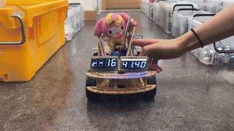
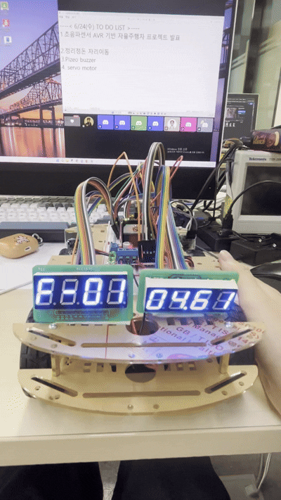
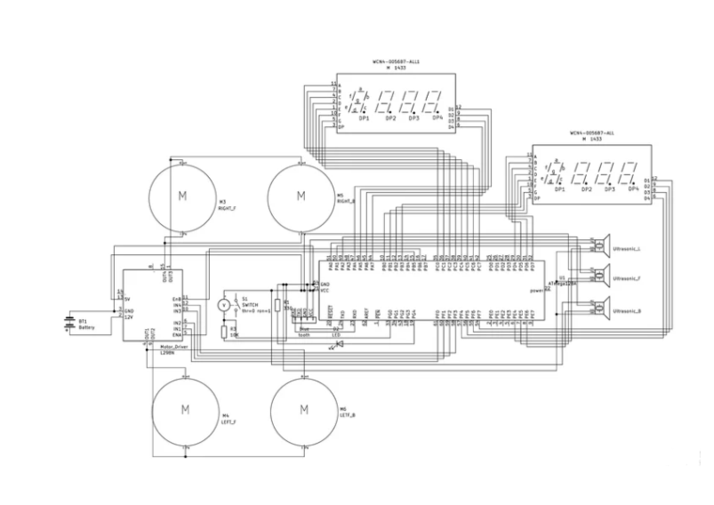
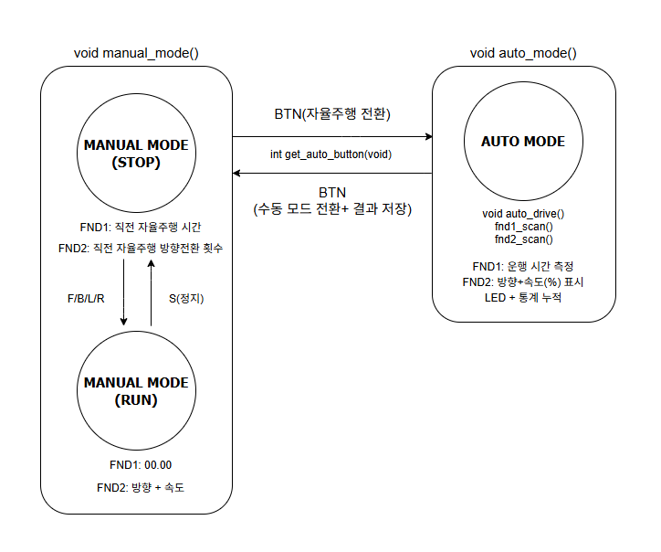

# AutoCar — 블루투스 RC카 + 자율주행

ATmega128A 기반 RC카. 블루투스 수동 조종 모드와 초음파 장애물 회피 자율주행 모드를 버튼 하나로 전환합니다.

---

### 동작 영상



---

### FND 동작 영상



- 직전 자율주행 내역 조회
    
    - FND1: 총 주행시간 저장
    
    - FND2: 방향(F/B/L/R)-횟수
---

## 🔧 기술 스택

| 분류 | 내용 |
|------|------|
| MCU | ATmega128A |
| 언어 | C (AVR-GCC) |
| IDE | Atmel Studio 7 |
| 통신 | UART0 (PC), UART1 (블루투스 ZS-040) |
| 센서 | HC-SR04 초음파 센서 × 3 (좌/정면/우) |
| 구동 | DC 모터 × 2 + L298N 모터 드라이버 |
| 표시 | FND(7세그) × 2 |
| 입력 | 버튼(PG0), LED(PG4) |

---

## 📐 하드웨어 핀맵

### 모터 드라이버 (L298N)
```
PB5 → OC1A  : 왼쪽 바퀴 PWM 속도
PB6 → OC1B  : 오른쪽 바퀴 PWM 속도
PF0 → IN1   : 왼쪽 모터 방향 A
PF1 → IN2   : 왼쪽 모터 방향 B
PF2 → IN3   : 오른쪽 모터 방향 A
PF3 → IN4   : 오른쪽 모터 방향 B
```

### 초음파 센서 (HC-SR04)
```
PA0 → 왼쪽 Trig     PE4(INT4) → 왼쪽 Echo
PA1 → 정면 Trig     PE5(INT5) → 정면 Echo
PA2 → 오른쪽 Trig   PE6(INT6) → 오른쪽 Echo
```

### FND
```
[FND1 - 스톱워치]            [FND2 - 방향/속도]
PD7~PD0 → 세그먼트 A~DP     PC0~PC7 → 세그먼트 A~DP
PF7~PF4 → 자릿수 D1~D4      PA4~PA7 → 자릿수 D1~D4
```

### 기타
```
PG0 → 모드 전환 버튼 (MANUAL ↔ AUTO)
PG4 → 자율주행 모드 LED
TXD/RXD → 블루투스 ZS-040 (UART1)
USB → PC 디버깅 (UART0)
```

---
### 회로도



---

## 파일 구조

```
AutoCar/
├── main.c          — 메인 루프, 초기화, 인터럽트 설정
├── auto_car.c/h    — 자율주행 FSM, 초음파, FND, LED, 버튼
├── pwm.c/h         — DC 모터 PWM 제어 (forward/backward/turn_left/turn_right/stop)
├── uart0.c/h       — PC 통신 (원형 큐 수신)
├── uart1.c/h       — 블루투스 수신 (bt_data)
├── button.c/h      — 버튼 입력 처리 (디바운싱)
└── fnd.c/h         — FND 멀티플렉싱
```

---

## 자율주행 FSM



### 최상위 모드 전환

```
전원 ON
   │
   ▼
MANUAL ◄──────── 버튼 누름 ────────► AUTO
(블루투스 조종)                     (자율주행 + LED ON + 스톱워치)
```

### AUTO 모드 내부 FSM

```
                    [AUTO 진입]
                        │
                        ▼
               ┌──── FORWARD ◄────────────────────────────┐
               │   (직진)                                  │
               │                                           │
       장애물 감지                                  장애물 벗어남 / 공간 확보
               │                                           │
    ┌──────────┼──────────┐                               │
    │          │          │                               │
한쪽 막힘   정면 막힘  좌우 막힘                              │
    │          │          │                               │
    ▼          ▼          ▼                               │
  AVOID      AVOID    BACKWARD ───────────────────────────┤
 (좌 또는    (넓은쪽   (후진)                             │
  우 회전)   으로 회전)                                   │
    │          │                                        │
    └────────────────── 2초 이상 갇힘 ──► STUCK ──────────┘
                                         (강제 후진 1초)
```

| 상태 | 조건 | 다음 상태 |
|------|------|-----------|
| FORWARD | 좌우 동시 막힘 | BACKWARD |
| FORWARD / AVOID / BACKWARD | 2초 이상 갇힘 | STUCK |
| AVOID | 장애물 벗어남 | FORWARD |
| BACKWARD | 공간 확보 | FORWARD |
| STUCK | 후진 1초 경과 | FORWARD |

---

## 주요 코드

### 1. 초음파 거리 측정 (인터럽트 방식)

에코 핀의 **상승엣지에서 타이머 시작, 하강엣지에서 거리 계산**한다.

```c
ISR(INT4_vect)   // 왼쪽 에코 (INT5=정면, INT6=오른쪽)
{
    if (ECHO_PORT & (1 << ECHO_LEFT))
        TCNT3 = 0;                             // 상승엣지: 타이머 초기화
    else
        dist_left = TCNT3 * 0.0034f / 2.0f;   // 하강엣지: 거리(cm) 계산
}
```

> 거리 공식 = 타이머 카운트 × (64분주 / 16MHz) × 음속(34000 cm/s) / 2

### 2. 자율주행 판단 로직

```c
void auto_drive(void)
{
    // 좌우 동시 막힘 → 후진
    if (dist_left < THRESHOLD && dist_right < THRESHOLD) {
        backward(500);
        return;
    }
    // 정면 또는 한쪽 막힘 → 회피
    if (dist_front < THRESHOLD) {
        if (dist_left > dist_right)
            turn_left(700);
        else
            turn_right(700);
        return;
    }
    // 한쪽만 막힘
    if (dist_left < THRESHOLD)  turn_right(700);
    if (dist_right < THRESHOLD) turn_left(700);
    // 이상 없음 → 직진
    forward(500);
}
```

### 3. UART 수신 — 인터럽트 + 원형 큐

인터럽트에서는 **저장만**, 실제 처리는 메인 루프에서 합니다 (생산자-소비자 패턴).

```c
// ISR: 저장만
ISR(USART0_RX_vect)
{
    char data = UDR0;
    if (data == '\n') {
        rx_buff[rear][idx] = '\0';
        rear = (rear + 1) % QUEUE_SIZE;   // 큐에 적재
        idx = 0;
    } else {
        rx_buff[rear][idx++] = data;
    }
}

// 메인 루프: 처리
void pc_command_processing(void)
{
    if (front != rear) {   // 큐에 데이터 있음
        if (strncmp(rx_buff[front], "f", 1) == 0) forward(500);
        else if (strncmp(rx_buff[front], "b", 1) == 0) backward(500);
        // ...
        front = (front + 1) % QUEUE_SIZE;
    }
}
```

### 4. FND 멀티플렉싱

한 번에 한 자리씩 빠르게 켜고 꺼서 4자리가 동시에 켜진 것처럼 보이게 합니다.

```c
void fnd1_display(int value)
{
    int digits[4] = { value/1000, (value/100)%10, (value/10)%10, value%10 };
    uint8_t digit_pin[4] = { FND_D1, FND_D2, FND_D3, FND_D4 };

    for (int i = 0; i < 4; i++) {
        FND1_DIGIT_PORT = ~(1 << digit_pin[i]);  // 자릿수 선택
        FND1_DATA_PORT  = seg_table[digits[i]];  // 세그먼트 출력
        _delay_ms(2);
        FND1_DATA_PORT  = 0x00;                  // 잔상 제거
    }
}
```

---

## 알아야 할 개념

### UART
- 시리얼 통신 프로토콜. TX/RX 두 선으로 데이터 송수신
- UART0: PC 디버깅, UART1: 블루투스(ZS-040)
- 보드레이트 9600bps, 2배속 모드(U2X0)로 오차 최소화

### Timer / PWM
- `Timer0` : 1ms 기준 타이머 (64분주, TCNT0=6으로 250 카운트 → 1ms)
- `Timer1` : 8비트 Fast PWM → 모터 속도 제어 (OCR1A, OCR1B로 듀티비 조절)
- `Timer3` : 초음파 에코 시간 측정용 자유 카운터

### 인터럽트
- `TIMER0_OVF_vect` : 1ms마다 `msec_count++` → 스톱워치, 타임아웃 판단
- `INT4/5/6` : 초음파 에코 핀 상승/하강엣지 감지
- `USART0/1_RX_vect` : 문자 수신 완료 시 버퍼에 저장

### volatile
인터럽트와 메인 루프가 **공유하는 변수**는 반드시 `volatile` 선언.  
컴파일러가 최적화로 레지스터에 캐싱하는 것을 방지함

### Polling vs Interrupt

| | Polling | Interrupt |
|--|---------|-----------|
| 방식 | CPU가 계속 확인 | 이벤트 발생 시 CPU에 알림 |
| CPU 점유 | 높음 | 낮음 |
| 반응 속도 | 느릴 수 있음 | 빠름 |
| 사용 예 | 버튼 입력 확인 | UART 수신, 초음파 에코 |

> 본 프로젝트에서 UART 수신과 초음파는 **인터럽트**로,
> 버튼은 메인 루프에서 **폴링**으로 처리했다.


```c
volatile uint32_t msec_count = 0;
volatile int dist_front = 0;
```

### DDR / PORT / PIN
```
DDR  = Data Direction Register : 핀 방향 설정 (1=출력, 0=입력)
PORT = 출력값 쓰기 / 입력 풀업 설정
PIN  = 입력값 읽기
```

### L298N 모터 드라이버 진리표
```
IN1  IN2  결과
 1    0   정방향
 0    1   역방향
 0    0   정지 (브레이크)
```

---

## 개발 메모

- PORTA가 초음파 Trig(PA0-2)와 FND2 자릿수(PA4-7)를 공유 
- PORTF가 모터 방향(PF0-3)과 FND1 자릿수(PF4-7)를 공유 
- 모터 배선이 반대로 꽂혀 `turn_left()`가 물리적으로 우회전 → 자율주행 로직 전체에 일관되게 적용되어 정상 동작
- L298N 구동 전원은 별도 12V 필요 
