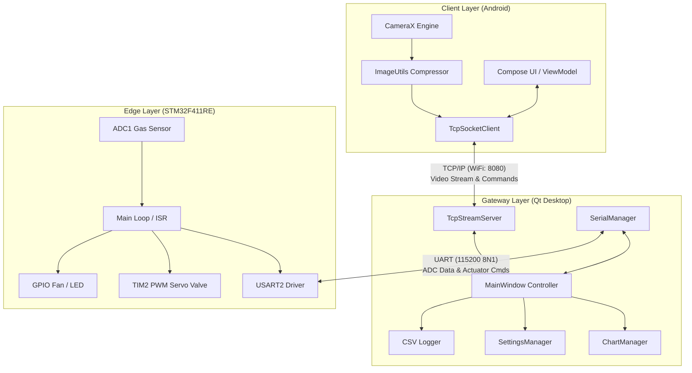
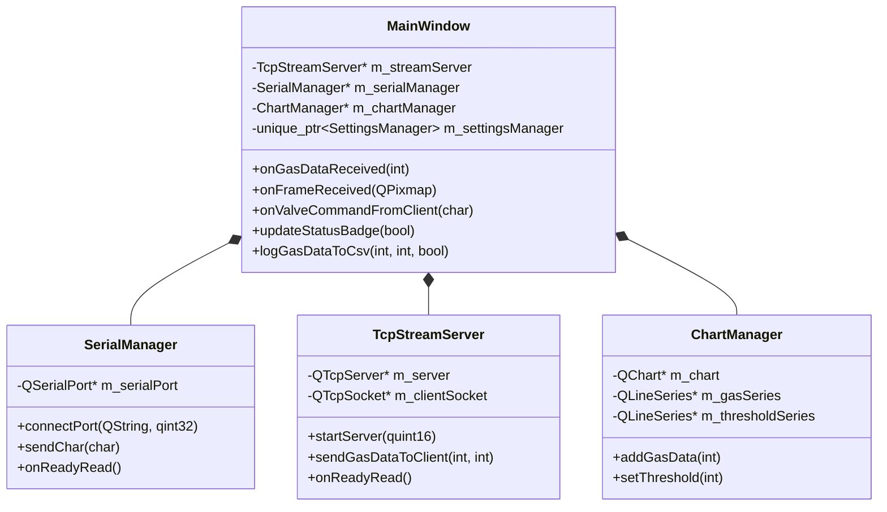
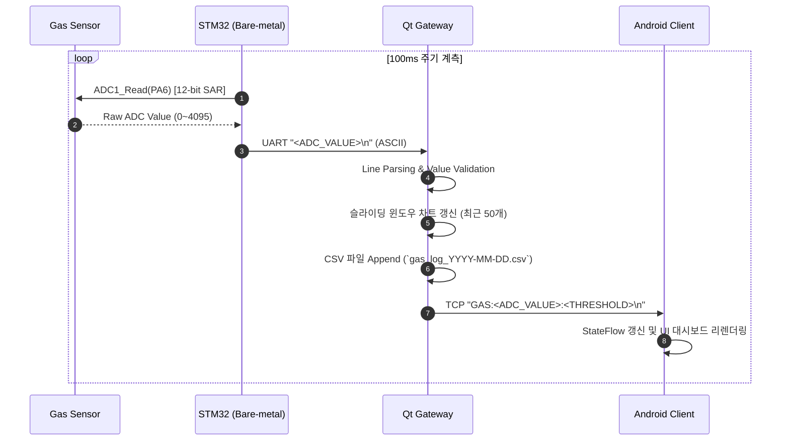
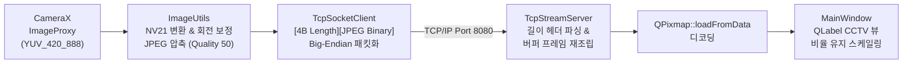
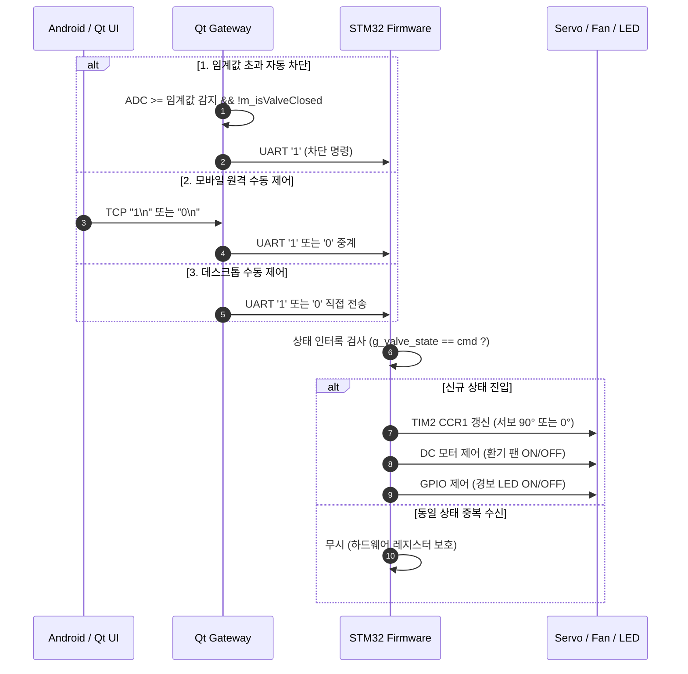
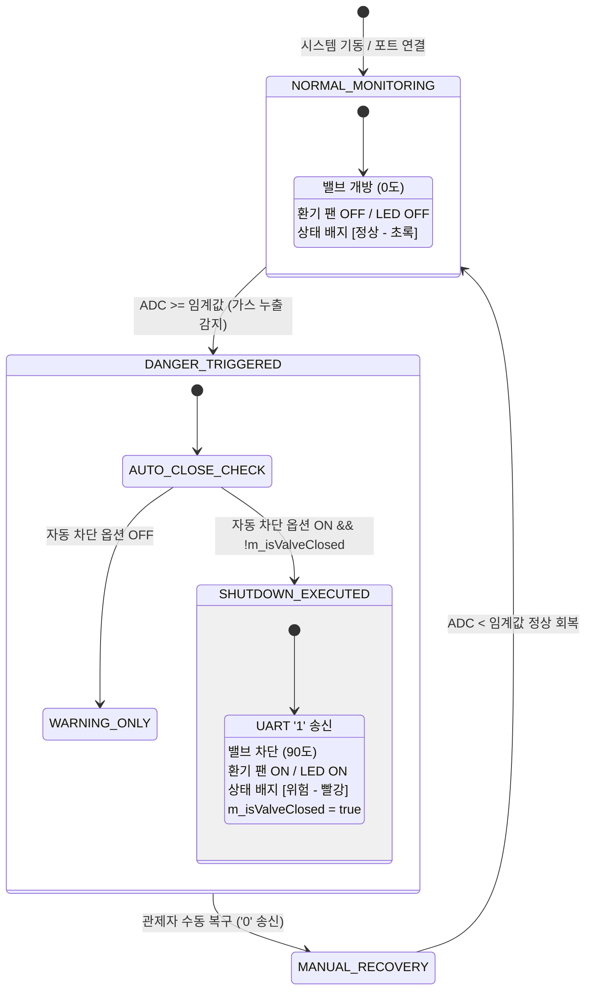
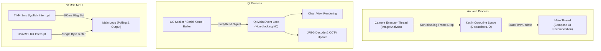

# 시스템 아키텍처 정의서 (System Architecture v1.0)

본 문서는 **스마트 가스 모니터링 시스템**의 3계층(3-Tier: 엣지 노드, 관제 게이트웨이, 모바일 클라이언트) 통합 소프트웨어 아키텍처, 노드별 책임 분담, 종단 간(End-to-End) 데이터 파이프라인, 그리고 시스템 안전 상태 머신(State Machine)을 정의합니다.

---

## 📋 목차

1. 시스템 아키텍처 개요
2. 계층별 책임 및 컴포넌트 구성
3. 종단 간(End-to-End) 데이터 파이프라인
4. 시스템 상태 머신 및 안전 메커니즘
5. 비동기 동시성(Concurrency) 및 이벤트 모델
6. 하드웨어/네트워크 토폴로지

---

## 1. 시스템 아키텍처 개요

본 시스템은 현장 계측/구동을 담당하는 **STM32 엣지 노드**, 데이터 통합 분석 및 정책 판정을 담당하는 **Qt 관제 게이트웨이**, 그리고 현장 영상 취득 및 원격 제어를 담당하는 **Android 클라이언트**로 구성됩니다.



---

## 2. 계층별 책임 및 컴포넌트 구성

### 2.1 계층별 책임 분담 원칙 (Separation of Concerns)

| 계층 | 주 책임 (Responsibilities) | 비책임 (Out of Scope) |
| :--- | :--- | :--- |
| **STM32 펌웨어** (Edge Node) | • 주기적 12비트 아날로그 가스 센서 계측<br>• 물리 액추에이터(서보 밸브, DC 팬, LED) 직접 구동<br>• 하드웨어 레지스터 제어 및 중복 실행 방지(인터록) | • 임계값 판정 로직<br>• 데이터 영속화(파일 저장)<br>• 영상 처리 |
| **Qt 서버** (Gateway) | • 이종 매체(UART ↔ TCP) 간 패킷 중계 및 변환<br>• 가스 수치 위험 판정 및 단일 트리거 자동 차단 제어<br>• 실시간 시계열 그래프 렌더링 및 CSV 데이터 로깅 | • 물리 신호 직접 생성<br>• 영상 캡처(촬영) |
| **Android 앱** (Client) | • CameraX 기반 영상 캡처 및 JPEG 압축 송신<br>• 실시간 가스 텔레메트리(`GAS:val:threshold`) 표시<br>• 관제자 수동 원격 제어 명령 송신 | • 가스 위험 판단<br>• 밸브 자동 차단 결정 |

---

### 2.2 계층별 모듈 아키텍처



---

## 3. 종단 간(End-to-End) 데이터 파이프라인

### 3.1 가스 계측 텔레메트리 파이프라인 (Uplink)



---

### 3.2 영상 스트리밍 파이프라인 (Uplink)

CameraX 프레임 분석기에서 Qt UI 화면 렌더링까지의 바이너리 전송 파이프라인입니다.



---

### 3.3 밸브 제어 및 안전 다운링크 (Downlink)



---

## 4. 시스템 상태 머신 및 안전 메커니즘

### 4.1 중앙 관제 상태 전이 모델 (Gateway State Machine)



---

### 4.2 안전 메커니즘 (Safety Features)

1. **단일 트리거 래치 (Single-Trigger Latching)**:
* 가스 수치가 임계값을 초과하더라도 `m_isValveClosed` 플래그를 통해 최초 1회만 차단 명령을 송신합니다. 통신 채널에 불필요한 트래픽이 누적되는 것을 방지합니다.


2. **소프트웨어 인터록 (Software Interlock)**:
* STM32 내부의 `g_valve_state` 변수를 통해 현재 액추에이터 상태와 동일한 요청이 들어오면 하드웨어 레지스터 갱신을 생략하여 서보 모터 튐 및 불필요한 I/O를 방지합니다.


3. **통신 두절 안전 모드 (Fail-Safe Extension)**:
* UART 및 TCP 소켓 연결 해제 발생 시 GUI 상태 배지를 즉시 갱신하고 재연결 대기 상태로 안전하게 전이합니다.


---

## 5. 비동기 동시성(Concurrency) 및 이벤트 모델

본 시스템은 실시간 데이터 계측과 고용량 비디오 스트리밍이 공존하므로, UI 프리징(Freezing)을 방지하기 위한 **비동기 이벤트 기반 동시성 모델**을 채택했습니다.



* **STM32 (ISR 최소화)**: 인터럽트 서비스 루틴(ISR)에서는 계측 플래그와 수신 버퍼만 빠르게 갱신하고, 실제 ADC 변환 및 UART 송신은 메인 루프에서 처리하여 인터럽트 지연(Latency)을 최소화합니다.
* **Qt Server (이벤트 드리븐 I/O)**: 블로킹 `read()` 호출 없이 `readyRead()` 시그널을 통해 이벤트 루프에서 데이터를 처리하며, UI 반응성을 유지합니다.
* **Android (코루틴 + 최신 프레임 킵)**: `STRATEGY_KEEP_ONLY_LATEST` 정책과 `Dispatchers.IO` 코루틴을 결합하여 네트워크 지연 시 이전 프레임을 자동으로 폐기, 지연(Latency) 누적을 방지합니다.

---

## 6. 네트워크 토폴로지 및 접속 모드

본 시스템은 현장 상황과 운용 환경에 따라 **2가지 네트워크 모드(로컬 LAN / 원격 Tailscale VPN)**를 유연하게 지원합니다.

### 6.1 지원 네트워크 모드

1. **로컬 핫스팟 / Wi-Fi 모드 (Local LAN)**
   * PC 핫스팟(`192.168.137.1`)에 안드로이드 폰이 직접 접속하는 내부망 환경
   * 공유기나 외부 인터넷 연결 없이도 단독 운용 가능 (현장 즉시 설치)
2. **Tailscale 오버레이 VPN 모드 (Remote Mesh Network - 권장 ⭐)**
   * Tailscale(WireGuard 기반) 가상 사설망(`100.64.0.0/10` 대역)을 적용
   * 스마트폰이 외부 LTE/5G 환경에 있더라도 복잡한 포트포워딩(DDNS)이나 공인 IP 설정 없이 안전하게 NAT를 통과(NAT Traversal)하여 PC 관제 서버(`100.72.78.11`)로 1:1 암호화 스트리밍

---

### 6.2 종합 통신 구성도

```text
[모드 1: 로컬 핫스팟]                         [모드 2: Tailscale 원격 오버레이 VPN]
Desktop PC (Hotspot AP)                       Desktop PC (Tailscale Node: 100.72.78.11)
  IP: 192.168.137.1 (Gateway)                   ▲
        ▲                                       │ Encrypted P2P Tunnel (WireGuard)
        │ Local Wi-Fi (TCP 8080)                │ (NAT Traversal / Anywhere over LTE/5G)
        ▼                                       ▼
Android Client (192.168.137.xxx)              Android Client (Tailscale Node: 100.xxx.xxx.xxx)

                                ┌───────────────────────┐
                                │      Desktop PC       │
                                │  (Qt Gateway Server)  │
                                └───────────┬───────────┘
                                            │ USB VCP (UART 115200 8N1)
                                            ▼
                                ┌───────────────────────┐
                                │  STM32F411RE Nucleo   │
                                │  (Edge Sensing Node)  │
                                └───────────┬───────────┘
                                            │
                        ┌───────────────────┼───────────────────┐
                        ▼                   ▼                   ▼
                 [ Gas Sensor ]       [ SG90 Servo ]      [ DC Fan / LED ]
                   (ADC1_IN6)           (TIM2_CH1)          (GPIO Out)