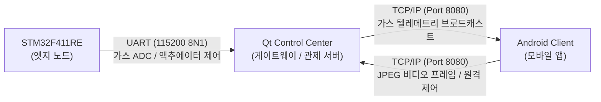
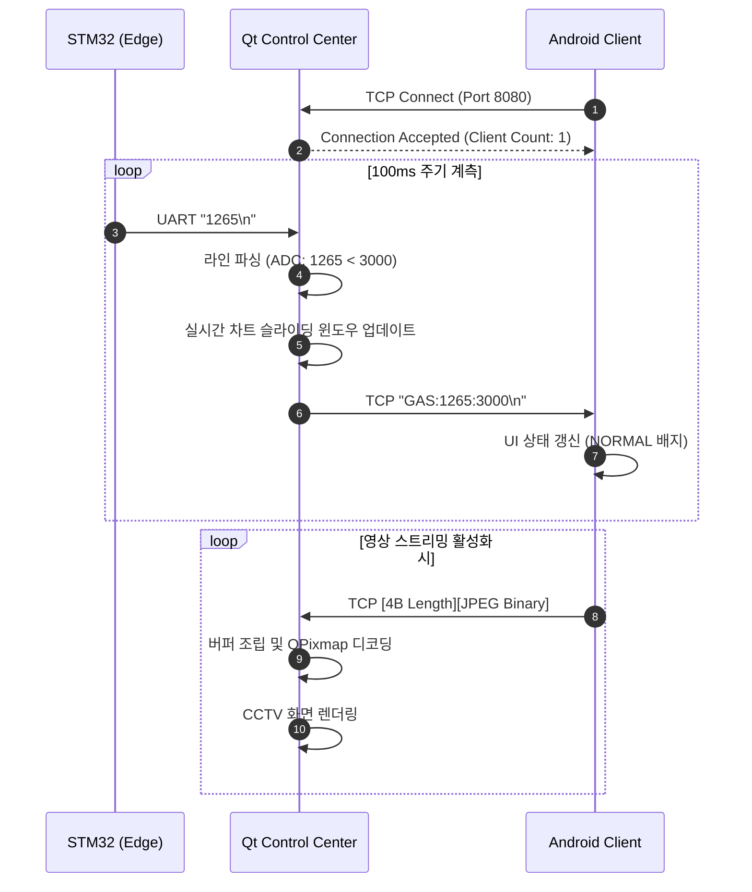
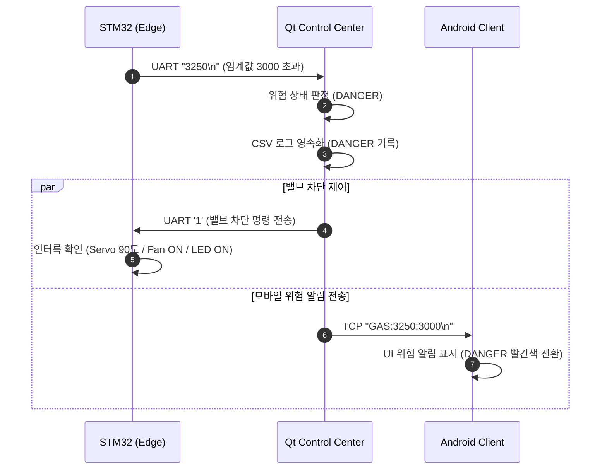
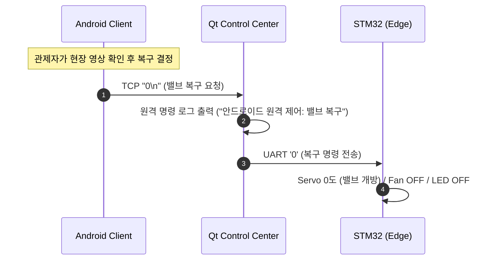

# 통신 프로토콜 명세서 (Protocol Specification v1.0)

본 문서는 **스마트 가스 모니터링 시스템**을 구성하는 3계층(STM32 펌웨어, Qt 데스크톱 관제 서버, Android 모바일 클라이언트) 간의 물리/전송 계층 사양, 패킷 포맷, 프레이밍(Framing) 기법 및 데이터 흐름을 정의합니다.

---

## 1. 통신 토폴로지 개요

시스템은 이종(Heterogeneous) 통신 매체를 사용하며, **Qt 데스크톱 서버가 중앙 게이트웨이(Gateway)** 역할을 수행하여 시리얼 패킷과 TCP 네트워크 패킷을 상호 중계합니다.



---

## 2. UART 시리얼 프로토콜 (STM32 ↔ Qt 서버)

STM32 MCU와 Qt 관제 서버 간의 유선 통신 규약입니다. 12비트 센서 원시 데이터 전송 및 하드웨어 액추에이터 제어 명령을 담당합니다.

### 2.1 물리 계층 사양 (Physical Layer)

| 항목 | 사양 |
| --- | --- |
| **통신 방식** | USB Virtual COM Port (FTDI / ST-Link VCP) |
| **MCU 핀 맵** | `PA2` (USART2_TX), `PA3` (USART2_RX) |
| **Baud Rate** | 115200 bps |
| **Data Bits** | 8 Bits |
| **Parity** | None |
| **Stop Bits** | 1 Bit |
| **Flow Control** | None |

---

### 2.2 상향 패킷: 가스 센서 텔레메트리 (STM32 → Qt 서버)

STM32에서 계측된 12비트 가스 센서 ADC 값을 개행 문자(`\n`)로 구분된 ASCII 문자열 형태로 주기적(100ms) 전송합니다.

* **전송 주기**: 100ms
* **포맷**: `<ADC_VALUE>\n`
* **유효 데이터 범위**: `0` ~ `4095` (12-bit ADC)

```text
[Packet Format]
+---------------------------------+------+
|  ASCII Decimal Value (1~4 Bytes)| 0x0A |
+---------------------------------+------+
```

**전송 예시:**

```text
1270\n    --> 정상 상태 계측값 (ADC: 1270)
3150\n    --> 임계값 초과 위험 계측값 (ADC: 3150)
```

---

### 2.3 하향 패킷: 액추에이터 통합 제어 (Qt 서버 → STM32)

관제 서버가 위험 임계값 초과를 감지(자동)하거나 사용자가 수동 버튼을 클릭했을 때 STM32로 전송하는 1바이트 제어 문자입니다.

| 명령 문자 | Hex Code | 액추에이터 동작 상태 | 비고 |
| :---: | :---: | :--- | :--- |
| `'1'` | `0x31` | **위험 차단 상태**<br>• 서보 모터: 90° (물리 밸브 차단)<br>• DC 모터: ON (환기 팬 가동)<br>• LED: ON (경보 표시) | 단일 트리거 래치 적용 |
| `'0'` | `0x30` | **정상 복구 상태**<br>• 서보 모터: 0° (물리 밸브 개방)<br>• DC 모터: OFF (환기 팬 정지)<br>• LED: OFF (경보 해제) | 소프트웨어 인터록 적용 |

---

## 3. TCP 네트워크 프로토콜 (Qt 서버 ↔ Android 클라이언트)

Qt 데스크톱 서버와 Android 모바일 앱 간의 무선 네트워크 프로토콜입니다. 단일 TCP 소켓 세션에서 **가변 길이 바이너리 영상 스트림**, **텍스트 제어 명령**, **실시간 센서 텔레메트리**를 멀티플렉싱(Multiplexing)하여 처리합니다.

### 3.1 네트워크 계층 사양

| 항목 | 사양 |
| :--- | :--- |
| **전송 계층 프로토콜** | TCP/IP |
| **서버 바인딩 주소** | `QHostAddress::AnyIPv4` (0.0.0.0) |
| **기본 서비스 포트** | `8080` (사용자 정의 변경 가능) |
| **네트워크 모드** | • **Local LAN**: Windows 모바일 핫스팟 (`192.168.137.1`)<br>• **Remote VPN**: Tailscale Mesh Network (`100.72.78.11`) |
| **연결 타임아웃** | 5000ms |

---

### 3.2 상향 패킷 A: 카메라 영상 스트리밍 (Android → Qt 서버)

CameraX로부터 캡처된 프레임을 YUV_420_888에서 NV21을 거쳐 JPEG로 압축한 후, 4바이트 길이 헤더(Length-Prefixed Framing)를 결합하여 바이너리로 전송합니다.

```text
[Binary Video Frame Packet Layout]
 0                   1                   2                   3
 0 1 2 3 4 5 6 7 8 9 0 1 2 3 4 5 6 7 8 9 0 1 2 3 4 5 6 7 8 9 0 1
+-+-+-+-+-+-+-+-+-+-+-+-+-+-+-+-+-+-+-+-+-+-+-+-+-+-+-+-+-+-+-+-+
|                 Payload Length (32-bit Big-Endian)            |
+-+-+-+-+-+-+-+-+-+-+-+-+-+-+-+-+-+-+-+-+-+-+-+-+-+-+-+-+-+-+-+-+
|                                                               |
|                       JPEG Binary Payload                     |
|                      (Variable: N Bytes)                      |
|                                                               |
+-+-+-+-+-+-+-+-+-+-+-+-+-+-+-+-+-+-+-+-+-+-+-+-+-+-+-+-+-+-+-+-+

```

* **Header (4 Bytes)**: JPEG 페이로드의 전체 바이트 크기 (`uint32_t`, Big-Endian)
* **Payload (N Bytes)**: 실제 압축된 JPEG 이미지 바이너리 데이터
* **압축 파라미터**: JPEG Quality 50, 4:3 Aspect Ratio (최신 프레임 우선 드롭 전략)

---

### 3.3 상향 패킷 B: 모바일 원격 밸브 제어 (Android → Qt 서버)

모바일 앱 사용자가 화면의 밸브 차단/복구 버튼을 터치했을 때 전송되는 제어 문자열입니다.

| 명령 문자열 | Hex Representation | 처리 동작 |
| --- | --- | --- |
| `"1\n"` 또는 `'1'` | `0x31 (0x0A)` | Qt 서버가 수신 후 STM32로 밸브 차단 명령 중계 |
| `"0\n"` 또는 `'0'` | `0x30 (0x0A)` | Qt 서버가 수신 후 STM32로 밸브 복구 명령 중계 |

> **💡 패킷 식별 매커니즘 (Server Demultiplexing):**
> Qt 서버(`TcpStreamServer`)는 수신 버퍼의 첫 번째 바이트가 `0x00`이 아니면서 `'1'` 또는 `'0'`인 경우 텍스트 제어 명령으로 우선 분기 처리하고, 첫 4바이트가 Big-Endian 길이 헤더 형태인 경우 영상 스트림 파서로 라우팅합니다.

---

### 3.4 하향 패킷: 가스 텔레메트리 중계 (Qt 서버 → Android)

Qt 서버가 STM32로부터 수신한 실시간 가스 수치와 현재 설정된 위험 임계값을 모바일 클라이언트로 실시간 브로드캐스트합니다.

* **포맷**: `GAS:<ADC_VALUE>:<THRESHOLD>\n`
* **구분자**: 콜론(`:`) 및 개행(`\n`)

**전송 예시:**

```text
GAS:1270:3000\n    --> 현재 가스값 1270, 임계값 3000 (정상)
GAS:3420:3000\n    --> 현재 가스값 3420, 임계값 3000 (위험 상태)
```

---

## 4. 전체 시나리오별 통신 시퀀스 다이어그램

### 4.1 가스 계측 및 실시간 모바일 모니터링 (정상 상태)



---

### 4.2 가스 누출 감지 및 자동 밸브 차단 (위험 상태)



---

### 4.3 모바일 앱을 통한 원격 수동 복구 제어



---

## 5. 예외 처리 및 방어적 설계 (Defensive Design)

### 5.1 TCP 패킷 단편화(Fragmentation) 대응

네트워크 지연이나 MTU 분할로 인해 영상 프레임이 여러 조각으로 나뉘어 수신되는 현상을 방지하기 위해, Qt 서버는 내부 `QByteArray m_buffer`를 유지합니다. 수신된 바이트가 헤더에 명시된 `m_imageSize`에 도달할 때까지 파싱을 대기하며 프레임 경계를 안전하게 복원합니다.

### 5.2 비정상 패킷 방어 (Oversized Packet Protection)

잘못된 데이터 수신으로 인한 메모리 고갈을 방지하기 위해, 파싱된 헤더 크기가 비정상적인 경우 버퍼를 강제 리셋합니다.

```cpp
// 비정상 패킷 크기 방어 로직 (0 이하 또는 10MB 초과)
if (m_imageSize <= 0 || m_imageSize > 10 * 1024 * 1024) {
    emit logMessage("비정상 패킷 감지. 버퍼를 초기화합니다.");
    m_buffer.clear();
    m_imageSize = 0;
    return;
}
```

### 5.3 시리얼 노이즈 및 결측 데이터 필터링

UART 라인에 글리치(Glitch) 노이즈가 유입될 경우를 대비하여, 파싱 결과가 숫자인지 확인하고 12비트 유효 범위(`0 <= ADC <= 4095`) 내의 데이터만 UI 및 판정 로직으로 전달합니다.