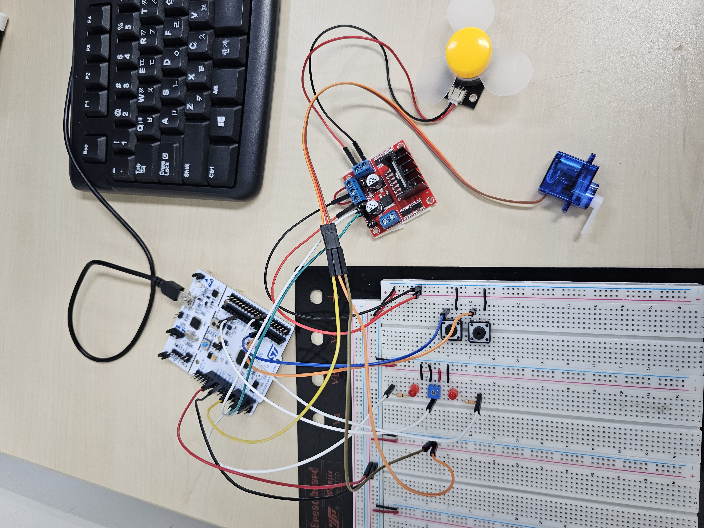
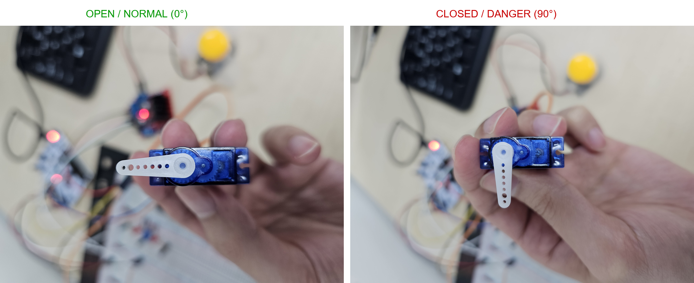

# 하드웨어 사양 및 핀맵 정의서 (Hardware Specification & Pinmap v1.0)

본 문서는 **스마트 가스 모니터링 시스템**의 엣지 노드(STM32F411RE)를 구성하는 센서 입력부, 액추에이터 구동부(서보 모터 / 모터 드라이버 / 차단벽 LED), 물리 키 입력부, 마이크로컨트롤러 핀 할당, 그리고 전원 무결성(Power Integrity) 설계를 정의합니다.

---

## 📋 목차

1. 하드웨어 시스템 개요 및 구성도
2. STM32F411RE 핀 할당 명세 (Pinout)
3. 가스 센서 계측 회로 (PA6 ADC 가변저항)
4. 액추에이터 구동부 및 제어 사양
5. 물리 스위치 입력 인터페이스 (PB4, PB5 수동 제어 키)
6. 전원 분리 및 전압 강하(Voltage Sag) 방어 회로
7. 하드웨어 결선 다이어그램 및 종합 배선 점검표

---

## 1. 하드웨어 시스템 개요 및 구성도

엣지 노드는 96MHz로 동작하는 **STM32F411RE Nucleo-64**를 중심으로 센서 입력 1채널, 물리 스위치 입력 2채널, 액추에이터 출력 4채널(서보 1, 모터 드라이버 2, LED 2), 그리고 시리얼 통신(UART) 1채널로 구성됩니다.

<div align="center">
  
  <p><b>[그림 1] STM32F411RE 엣지 노드 및 브레드보드 하드웨어 결선도</b></p>
</div>

```text
                                  +-----------------------+
                                  | STM32F411RE Nucleo-64 |
                                  |   (96MHz Bare-metal)  |
                                  +-----------+-----------+
                                              |
      +-----------------+-----------------+---+-------------+-----------------+-----------------+
      | (ADC1 / PA6)    | (TIM2 / PA0)    | (GPIOC / PC0,1) | (GPIOB / PB0,1) | (GPIOB / PB4,5) | (USART2 / PA2,3)
      ▼                 ▼                 ▼                 ▼                 ▼                 ▼
+-----------+     +-----------+     +-----------+     +-----------+     +-----------+     +-----------+
| 가변저항   |    | SG90 서보 |      | 모터드라이버|    | 차단벽 LED|     | 수동 제어  |    | Qt PC     |
| (가스 센서)|    | (물리 밸브)|     | (DC 팬모터)|    | (2채널)   |      | 키 스위치 |     | 게이트웨이 |
+-----------+     +-----------+     +-----------+     +-----------+     +-----------+     +-----------+
```

---

## 2. STM32F411RE 핀 할당 명세 (Pinout)

모든 GPIO 핀은 HAL 라이브러리 없이 레지스터 직접 제어로 설정되며, 내부 풀업 저항 및 Alternate Function 멀티플렉서를 적용합니다.

```text
                  [ STM32F411RE Nucleo-64 (CN7/CN10) ]
                        +--------------------+
        (TIM2_CH1)  PA0 |  1 (CN7)  28 (CN10)| PA6  (ADC1_IN6 - 가변저항 센서)
        (Driver IN1)PC0 | 38 (CN7)  27 (CN10)| PA5  (Board User LED)
        (Driver IN2)PC1 | 36 (CN7)  26 (CN10)| PA4  (NC)
        (USART2_TX) PA2 |  3 (CN7)  25 (CN10)| +5V  (External / Board 5V)
        (USART2_RX) PA3 |  4 (CN7)  24 (CN10)| GND  (Common Power GND)
                   +3V3 |  5 (CN7)  23 (CN10)| GND  (Analog GND)
                        +--------------------+
        (차단벽 LED1) PB0 | 34 (CN7)  19 (CN10)| PB4  (KEY1: 밸브 차단 스위치)
        (차단벽 LED2) PB1 | 24 (CN7)  17 (CN10)| PB5  (KEY2: 밸브 복구 스위치)
                        +--------------------+
```

### 2.1 핀 기능 및 전기적 특성 표

| 핀 번호 | 포트 모드 (MODER) | Alternate Function | 신호 레벨 | 드라이브/입력 모드 | 연결 장치 및 세부 기능 |
| --- | --- | --- | --- | --- | --- |
| **PA0** | Alternate Function (`10b`) | **AF1** (TIM2) | 3.3V Logic (5V Servo) | Push-Pull, High-Speed | **SG90 서보 모터 PWM 제어 신호선** (50Hz 펄스) |
| **PA2** | Alternate Function (`10b`) | **AF7** (USART2) | 3.3V TTL | Push-Pull, High-Speed | **USART2 TX** (ST-Link USB VCP $\rightarrow$ Qt 서버) |
| **PA3** | Alternate Function (`10b`) | **AF7** (USART2) | 3.3V TTL | Floating Input | **USART2 RX** (Qt 서버 $\rightarrow$ 밸브 제어 수신) |
| **PA6** | Analog Mode (`11b`) | — | 0.0V ~ 3.3V | High-Z Analog | **가스 센서 아날로그 입력** (ADC1 Channel 6, 가변저항) |
| **PB0** | Output (`01b`) | — | 3.3V Logic | Push-Pull, Low-Speed | **차단벽 경보 LED 1 제어선** (High: 점등) |
| **PB1** | Output (`01b`) | — | 3.3V Logic | Push-Pull, Low-Speed | **차단벽 경보 LED 2 제어선** (High: 점등) |
| **PB4** | Input (`00b`) | — | 3.3V Logic | Pull-Up Input | **KEY1: 현장 수동 밸브 차단 버튼** (Active-Low) |
| **PB5** | Input (`00b`) | — | 3.3V Logic | Pull-Up Input | **KEY2: 현장 수동 밸브 복구 버튼** (Active-Low) |
| **PC0** | Output (`01b`) | — | 3.3V Logic | Push-Pull, Low-Speed | **모터 드라이버 IN1 제어선** (DC 팬 정회전) |
| **PC1** | Output (`01b`) | — | 3.3V Logic | Push-Pull, Low-Speed | **모터 드라이버 IN2 제어선** (DC 팬 정지/제동) |

---

## 3. 가스 센서 계측 회로 (PA6 ADC 가변저항)

가변저항 모듈(가스 농도 모사 장치)의 분압 전압($0.0\text{V} \sim 3.3\text{V}$)을 STM32의 12비트 SAR(Successive Approximation Register) ADC1 채널 6(`PA6`)으로 직접 인가하여 계측합니다.

```text
        +3.3V (MCU VDD / Analog Reference)
          │
         ┌┴┐
         │ │  정밀 분압 가변저항 (가스 농도 모사)
         └┬┘
          ├────────── PA6 (ADC1_IN6 아날로그 입력)
         ┌┴┐
         │ │  10kΩ 저항
         └┬┘
          │
         GND (Analog Ground)
```

### 3.1 ADC 파라미터 및 변환 수식

* **해상도**: 12-bit (0 ~ 4095)
* **클럭 소스**: APB2 Clock (96MHz) $\div$ Prescaler 6 = **16MHz ADC Clock**
* **샘플링 주기**: 480 ADC Cycles (`SMPR2[20:18] = 111b`)
* **변환 시간 계산**:

$$T_{\text{conv}} = \text{Sampling Time} + 12\text{ Cycles} = 480 + 12 = 492\text{ Cycles}$$


$$T_{\text{total}} = \frac{492}{16\text{ MHz}} = 30.75\mu\text{s}$$


* **전압 변환 수식**:
  $$V_{\mathrm{sensor}} = \frac{\mathrm{ADC\_Value}}{4095} \times 3.3\,\mathrm{V}$$


---

## 4. 액추에이터 구동부 및 제어 사양

### 4.1 SG90 서보 모터 (물리 밸브)

TIM2 채널 1의 16비트 타이머 하드웨어 PWM을 사용하여 서보 모터의 각도를 제어합니다.

```text
    TIM2 PWM Pulse Output (PA0, 50Hz / 20ms Period)
    
    [0도 개방 펄스: 0.5ms]
    +---+
    |   |___________________________________________ (19.5ms Low)
    <---> 500us (CCR1 = 500)
    
    [90도 차단 펄스: 1.5ms]
    +---------+
    |         |_____________________________________ (18.5ms Low)
    <-------> 1500us (CCR1 = 1500)
```

* **타이머 클럭**: 96MHz (APB1 Prescaler x2 적용)
* **프리스케일러 (PSC)**: $96 - 1 = 95$ ($1\text{ tick} = 1\mu\text{s}$)
* **자동 재로드 레지스터 (ARR)**: $20000 - 1 = 19999$ ($20\text{ms}$ 주기)

| 밸브 상태 | 목표 각도 | 제어 펄스 폭 ($T_{\text{on}}$) | TIM2->CCR1 설정값 | 물리적 상태 및 안전 의미 |
| --- | --- | --- | --- | --- |
| **정상 (개방)** | **$0^\circ$** | $500\mu\text{s}$ ($0.5\text{ms}$) | `500` | 가스 배관 개방 (정상 공급 상태) |
| **위험 (차단)** | **$90^\circ$** | $1500\mu\text{s}$ ($1.5\text{ms}$) | `1500` | 가스 배관 차단 (가스 누출 방지) |

<div align="center">
  
  <p><b>[그림 2] 50Hz PWM 신호에 따른 SG90 서보 밸브 개방(0°) 및 차단(90°) 상태 비교</b></p>
</div>

---

### 4.2 모터 드라이버 기반 DC 환기 팬 구동 회로

DC 모터는 모터 드라이버 모듈(H-Bridge IC)을 통해 구동되며, MCU의 `PC0` 및 `PC1` 핀으로 정회전 및 정지 상태를 제어합니다.

```text
    [STM32 Nucleo]             [모터 드라이버 모듈]              [DC 모터]
    
    PC0 (GPIO Out) ───────────> IN1 (입력 1)
                                             OUT1 ─────────────> Motor (+)
    PC1 (GPIO Out) ───────────> IN2 (입력 2)
                                             OUT2 ─────────────> Motor (-)
    5V Power       ───────────> VCC / VM (모터 전원)
    Common GND     ───────────> GND (공통 접지)
```

| 제어 모드 | PC0 (IN1) | PC1 (IN2) | 모터 동작 상태 | 시스템 적용 상황 |
| --- | --- | --- | --- | --- |
| **정회전 (ON)** | **High (1)** | **Low (0)** | 환기 팬 강제 가동 | 가스 임계값 초과 차단 상태 (`'1'`) |
| **정지 (OFF)** | **Low (0)** | **Low (0)** | 환기 팬 대기/정지 | 정상 모니터링 복구 상태 (`'0'`) |

---

### 4.3 차단벽 표시 LED 회로 (PB0, PB1)

물리 차단벽 및 시스템 경보 상태를 시각화하기 위해 `PB0`, `PB1` 핀으로 2개의 고휘도 LED를 구동합니다.

```text
    PB0 (3.3V Logic) ───[ 220Ω ]───(▶| 차단벽 LED 1 )─── GND
    PB1 (3.3V Logic) ───[ 220Ω ]───(▶| 차단벽 LED 2 )─── GND
```

* **동통 전류 ($I_F$)**:

$$I_F = \frac{3.3\text{ V} - 2.0\text{ V}}{220\Omega} \approx 5.9\text{ mA} \quad (\text{MCU 핀당 허용 전류 25mA 이하 준수})$$


---

## 5. 물리 스위치 입력 인터페이스 (PB4, PB5 수동 제어 키)

네트워크나 PC 게이트웨이 없이도 현장에서 비상 시 즉각 밸브를 개폐할 수 있도록 택트 스위치(키) 2개를 연결합니다.

```text
    +3.3V
      │
     [R_PU] (내부 풀업 저항: ~40kΩ)
      │
      ├────────── PB4 / PB5 (MCU 입력 핀)
      │
     [SW] (Tact Switch)
      │
     GND
```

* **입력 방식**: Active-Low (스위치를 누르면 GND와 연결되어 `0` 입력)
* **PB4 (KEY1)**: 현장 수동 **밸브 즉시 차단** (서보 90°, 팬 ON, LED ON)
* **PB5 (KEY2)**: 현장 수동 **밸브 복구/개방** (서보 0°, 팬 OFF, LED OFF)

---

## 6. 전원 분리 및 전압 강하(Voltage Sag) 방어 회로

서보 모터와 DC 모터 기동 시 발생하는 대전류 서지($0.5\text{A} \sim 1.0\text{A}$)로 인해 $V_{\text{REF}}$(ADC 기준 전압)가 강하되어 센서 측정값이 튀는 현상을 방지하기 위해 전원 분리 설계를 적용합니다.

```text
  +5V Power Rail ───────────┬───────────────────────────────┬───────────────────────────┐
                            │                               │                           │
                     [ 470uF / 16V ]                 [ 100uF / 16V ]             [ 0.1uF Ceramic ]
                     (전해 캐패시터)                  (전해 캐패시터)              (디커플링)
                            │                               │                           │
                            ▼                               ▼                           ▼
                     [ SG90 Servo ]                  [ Motor Driver ]            [ Nucleo Board 5V ]
                            │                               │                           │
                            ▼                               ▼                           ▼
  Common GND ───────────────┴───────────────────────────────┴───────────────────────────┴──────── GND
```

1. **벌크 캐패시터 배치**: 서보 모터 전원단($470\mu\text{F}$), 모터 드라이버 전원단($100\mu\text{F}$)에 전해 캐패시터를 병렬 배치하여 순간 전압 강하 완충.
2. **단일점 공통 접지(Star Ground)**: 모터 대전류 접지선과 센서 아날로그 접지선을 한 점에서 결합하여 Ground Bounce 방지.

---

## 7. 하드웨어 결선 다이어그램 및 종합 배선 점검표

### 7.1 종합 배선 결선 명세표

| 구분 | 장치명 | 장치 핀 / 와이어 | Nucleo 연결 핀 | 기능 및 비고 |
| :--- | :--- | :--- | :---: | :--- |
| **센서** | 가변저항 모듈 | VCC | `+3V3` | 아날로그 기준 전원 |
| | | GND | `GND` | 아날로그 접지 |
| | | OUT | `PA6` | ADC1 Channel 6 아날로그 입력 |
| **서보** | SG90 서보 모터 | VCC (Red) | `5V` | 470uF 캐패시터 병렬 연결 |
| | | GND (Brown) | `GND` | 공통 접지 |
| | | PWM (Orange) | `PA0` | TIM2_CH1 PWM 신호 |
| **DC 팬** | 모터 드라이버 | VCC / VM | `5V` | 100uF 캐패시터 병렬 연결 |
| | | GND | `GND` | 공통 접지 |
| | | IN1 | `PC0` | DC 팬 정회전 제어 |
| | | IN2 | `PC1` | DC 팬 정지 제어 |
| | | OUT1, OUT2 | DC 모터 단자 | 팬 모터 전원 출력 |
| **LED** | 차단벽 LED 1 | Anode (+) | `PB0` | 220Ω 저항 직렬 연결 |
| | | Cathode (-) | `GND` | 공통 접지 |
| | 차단벽 LED 2 | Anode (+) | `PB1` | 220Ω 저항 직렬 연결 |
| | | Cathode (-) | `GND` | 공통 접지 |
| **키 스위치** | 수동 차단 키 (KEY1) | 단자 1 (Signal)<br>단자 2 (Ground) | `PB4`<br>`GND` | 내부 풀업, Active-Low (누르면 GND 연결) |
| | 수동 복구 키 (KEY2) | 단자 1 (Signal)<br>단자 2 (Ground) | `PB5`<br>`GND` | 내부 풀업, Active-Low (누르면 GND 연결) |