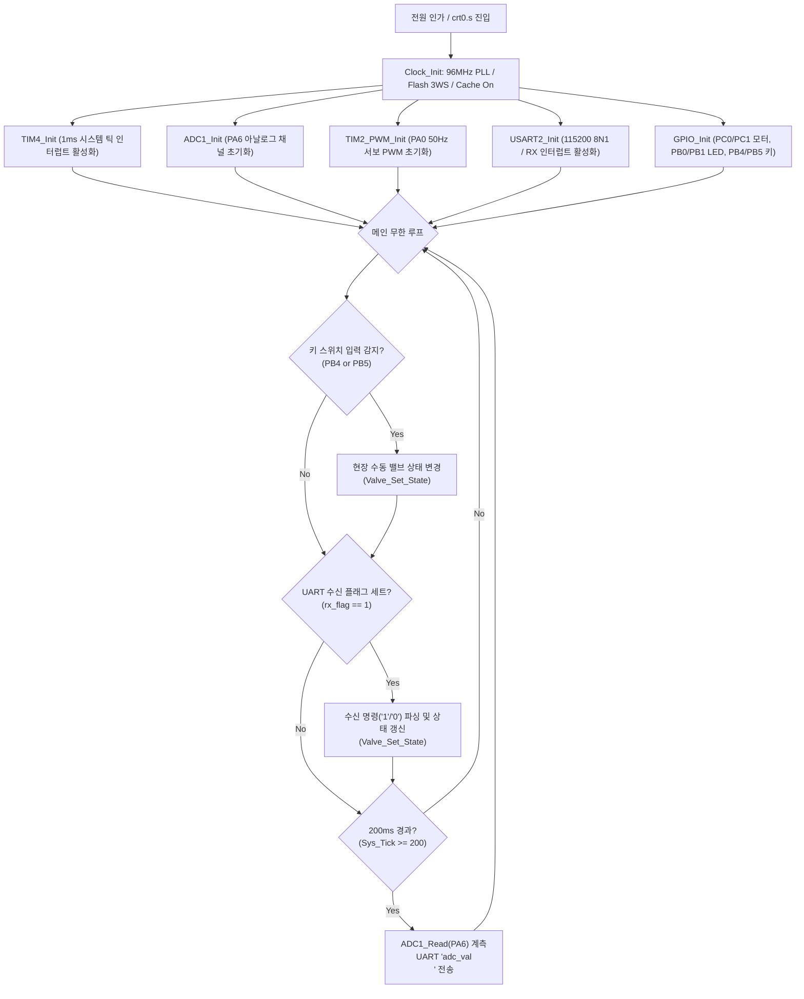

# STM32 베어메탈 펌웨어 드라이버 설계서 (Firmware Driver Guide v1.0)

본 문서는 **스마트 가스 모니터링 시스템**의 엣지 노드인 STM32F411RE 펌웨어의 베어메탈(Bare-metal) 아키텍처, 96MHz PLL 클럭 트리, 레지스터 직접 제어 기반의 주변장치(ADC, TIM, USART, GPIO) 드라이버 구현 방식 및 인터럽트 서비스 루틴(ISR) 처리 구조를 정의합니다.

---

## 📋 목차

1. 펌웨어 아키텍처 및 메인 루프 실행 모델
2. 시스템 클럭 트리 및 Flash 가속기 설정 (Clock_Init)
3. 12비트 SAR ADC 드라이버 (adc.c)
4. 하드웨어 타이머 및 PWM 드라이버 (timer.c)
5. 비동기 USART 통신 드라이버 (uart.c / isr.c)
6. 액추에이터 및 키 입력 드라이버 (led.c / motor.c / key.c)
7. 상태 기반 소프트웨어 인터록(Interlock) 설계

---

## 1. 펌웨어 아키텍처 및 메인 루프 실행 모델

본 펌웨어는 상용 RTOS나 제조사 HAL 라이브러리 없이, 레지스터 직접 제어(CMSIS 헤더 + 비트 연산 매크로)로 구현된 **비동기 이벤트 드리븐 베어메탈 구조**를 갖습니다.

* **인터럽트 최소화 원칙**: ISR 내부에서는 플래그 설정과 단일 바이트 버퍼링만 수행하고, 실제 연산 및 하드웨어 구동은 메인 루프에서 처리하여 인터럽트 지연(Latency)을 최소화합니다.
* **논블로킹 타이밍 스케줄링**: TIM4 1ms 하드웨어 인터럽트로 갱신되는 `Sys_Tick` 카운터를 기반으로 메인 루프가 **200ms** 주기로 가스 센서를 계측하고 UART로 전송합니다.



---

## 2. 시스템 클럭 트리 및 Flash 가속기 설정 (Clock_Init)

MCU의 연산 성능과 주변장치 타이밍 정확도를 위해 내부 HSI(16MHz) 오실레이터를 PLL로 체배하여 최대 주파수인 **SYSCLK = 96MHz**로 구동합니다.

```text
[HSI 16MHz] ──> [/8 (PLLM)] ──> [*192 (PLLN)] ──> [/4 (PLLP)] ──> [SYSCLK 96MHz]
                                                                        │
    ┌───────────────────────────┬───────────────────────────────────────┤
    ▼                           ▼                                       ▼
 [HCLK: 96MHz]           [PCLK2: 96MHz (APB2)]                  [PCLK1: 48MHz (APB1)]
 (AHB Prescaler /1)      (APB2 Prescaler /1)                    (APB1 Prescaler /2)
    │                           │                                       │
 [Core, Flash, DMA]       [ADC1 Clock: 16MHz (/6)]               [TIM2~5: 96MHz (*2)]
```

### 2.1 주요 레지스터 설정 상세

1. **Flash 레이턴시 및 캐시 활성화 (`FLASH->ACR`)**:
* 96MHz 전압 스케일(Scale 2) 환경에 맞춰 Flash 액세스 대기 시간을 3 WS(Wait States)로 설정합니다.
* 명령어 프리페치(PRFTEN), I-Cache(ICEN), D-Cache(DCEN)를 동시 활성화하여 메모리 병목을 제거합니다.


```c
FLASH->ACR = (1 << 10) | (1 << 9) | (1 << 8) | (0x3 << 0);

```


2. **PLL 체배비 설정 (`RCC->PLLCFGR`)**:
* VCO 주파수: `16MHz * (192 / 8) = 384MHz`
* 시스템 클럭: `384MHz / 4 = 96MHz`


3. **버스 분주비 설정 (`RCC->CFGR`)**:
* AHB Prescaler = `/1` (`HCLK = 96MHz`)
* APB1 Prescaler = `/2` (`PCLK1 = 48MHz`, 저속 주변장치 제한 50MHz 준수)
* APB2 Prescaler = `/1` (`PCLK2 = 96MHz`)


---

## 3. 12비트 SAR ADC 드라이버 (adc.c)

가스 농도에 비례하는 가변저항의 분압 전압을 `PA6`(ADC1_IN6) 핀으로 읽어옵니다.

### 3.1 드라이버 소스 코드 및 레지스터 제어

```c
#include "device_driver.h"
#include "adc.h"

void ADC1_Init(void)
{
    // 1. GPIOA 클럭 활성화 (AHB1ENR Bit 0)
    Macro_Set_Bit(RCC->AHB1ENR, 0U);

    // 2. PA6 핀 아날로그 모드(11b) 설정 (MODER [13:12])
    Macro_Write_Block(GPIOA->MODER, 0x3, 0x3, 12U);

    // 3. ADC1 클럭 활성화 (APB2ENR Bit 8)
    Macro_Set_Bit(RCC->APB2ENR, 8U);

    // 4. CH6 샘플링 타임: 480 Cycles 설정 (SMPR2 [20:18] = 111b)
    Macro_Write_Block(ADC1->SMPR2, 0x7, 0x7, 18U);

    // 5. 정규 시퀀스 변환 길이: 1개 (SQR1 [23:20] = 0x0)
    Macro_Write_Block(ADC1->SQR1, 0xF, 0x0, 20U);

    // 6. 1st 변환 채널로 CH6(PA6) 지정 (SQR3 [4:0] = 6)
    Macro_Write_Block(ADC1->SQR3, 0x1F, 6U, 0U);

    // 7. ADC 공통 클럭 프리스케일러: PCLK2 / 6 = 16MHz (ADC_CCR [17:16] = 0x2)
    Macro_Write_Block(ADC->CCR, 0x3, 0x2, 16U);

    // 8. ADC1 전원 인에이블 (CR2 Bit 0: ADON)
    Macro_Set_Bit(ADC1->CR2, 0U);
}

unsigned short ADC1_Read(void)
{
    // 소프트웨어 변환 트리거 (CR2 Bit 30: SWSTART)
    Macro_Set_Bit(ADC1->CR2, 30U);

    // 변환 완료(EOC) 플래그 대기
    while (!Macro_Check_Bit_Set(ADC1->SR, 1U))
        ;

    // EOC 플래그 클리어
    Macro_Clear_Bit(ADC1->SR, 1U);

    // 12비트 디지털 결과값 반환 (0 ~ 4095)
    return (unsigned short)(ADC1->DR & 0xFFFU);
}
```

* **샘플링 시간(480 Cycles) 선정 이유**: 가변저항 및 입력 라인의 기생 캐패시턴스로 인한 임피던스 영향을 최소화하고 노이즈를 억제하여 안정된 ADC 값을 얻기 위함입니다.

---

## 4. 하드웨어 타이머 및 PWM 드라이버 (timer.c)

시스템에는 2개의 하드웨어 타이머가 사용됩니다:

1. **TIM4**: 1ms 단위 시스템 틱 카운터 (`Sys_Tick`) 생성
2. **TIM2**: 물리 밸브 구동용 50Hz 정밀 서보 PWM 생성

### 4.1 TIM4 시스템 틱 타이머 (1ms)

* **타이머 입력 클럭**: 96MHz (APB1 x2)
* **프리스케일러 (PSC)**: `960 - 1` (1 tick = 10µs)
* **주기 (ARR)**: `100 - 1` (10µs * 100 = 1ms)
* **인터럽트**: 매 1ms마다 `TIM4_IRQHandler`가 호출되어 `Sys_Tick++` 수행. 메인 루프에서 `Sys_Tick >= 200`을 검사하여 **200ms** 계측 주기를 유지.

---

### 4.2 TIM2 서보 모터 PWM 드라이버 (50Hz)

물리 밸브(SG90)를 0°(개방) 또는 90°(차단)로 회전시키기 위한 드라이버입니다.

```c
void TIM2_PWM_Init(void)
{
    // 1. GPIOA 및 TIM2 클럭 활성화
    Macro_Set_Bit(RCC->AHB1ENR, 0U);
    Macro_Set_Bit(RCC->APB1ENR, 0U);

    // 2. PA0 핀을 Alternate Function 모드(AF1)로 설정
    Macro_Write_Block(GPIOA->MODER, 0x3, 0x2, 0U);
    Macro_Write_Block(GPIOA->AFR[0], 0xF, 0x1, 0U);

    // 3. 1us 틱 및 20ms 주기 설정 (타이머 클럭 96MHz 기준)
    TIM2->PSC = 96U - 1U;            // 96MHz / 96 = 1MHz (1 tick = 1us)
    TIM2->ARR = 20000U - 1U;         // 20000us = 20ms (50Hz)

    // 4. PWM Mode 1 (Active until match) 및 출력 인에이블
    Macro_Write_Block(TIM2->CCMR1, 0x7, 0x6, 4U);
    Macro_Set_Bit(TIM2->CCMR1, 3U);  // OC1PE = 1 (Preload Enable)
    Macro_Set_Bit(TIM2->CCER, 0U);   // CC1E = 1 (출력 활성화)

    // 5. 기본 각도 설정: 0도 (500us)
    TIM2->CCR1 = 500U;

    // 6. 카운터 시작
    Macro_Set_Bit(TIM2->EGR, 0U);
    Macro_Set_Bit(TIM2->CR1, 0U);
}

void Servo_Set_Angle(int angle)
{
    // 0도 -> 500us, 90도 -> 1500us 선형 매핑
    unsigned int pulse_us = 500U + (unsigned int)((angle * 1000) / 90);
    if (pulse_us > 2500U) pulse_us = 2500U;
    TIM2->CCR1 = pulse_us;
}
```

---

## 5. 비동기 USART 통신 드라이버 (uart.c / isr.c)

PC 관제 게이트웨이(Qt)와의 통신을 담당하는 USART2 드라이버입니다.

### 5.1 USART2 초기화 (115200 8N1)

* **물리 핀**: `PA2` (TX, AF7), `PA3` (RX, AF7)
* **보드레이트 계산 (PCLK1 = 48MHz)**:
* `USARTDIV = 48,000,000 / (16 * 115200) ≈ 26.0416`
* `DIV_Mantissa = 26 = 0x1A`
* `DIV_Fraction = 0.0416 * 16 ≈ 1 = 0x1`
* `USART2->BRR = 0x01A1`


```c
void USART2_Init(void)
{
    Macro_Set_Bit(RCC->AHB1ENR, 0U);
    Macro_Set_Bit(RCC->APB1ENR, 17U);

    // PA2, PA3 AF7 설정
    Macro_Write_Block(GPIOA->MODER, 0x3, 0x2, 4U);
    Macro_Write_Block(GPIOA->MODER, 0x3, 0x2, 6U);
    Macro_Write_Block(GPIOA->AFR[0], 0xF, 0x7, 8U);
    Macro_Write_Block(GPIOA->AFR[0], 0xF, 0x7, 12U);

    USART2->BRR = 0x01A1;
    USART2->CR1 = (1 << 13) | (1 << 3) | (1 << 2) | (1 << 5); // UE, TE, RE, RXNEIE

    NVIC_EnableIRQ(USART2_IRQn);
}
```

### 5.2 인터럽트 서비스 루틴 (isr.c)

```c
volatile char g_rx_cmd = 0;
volatile unsigned char g_rx_flag = 0;

void USART2_IRQHandler(void)
{
    if (Macro_Check_Bit_Set(USART2->SR, 5U)) // RXNE 플래그 확인
    {
        g_rx_cmd = (char)(USART2->DR & 0xFF);
        g_rx_flag = 1;
    }
}
```

---

## 6. 액추에이터 및 키 입력 드라이버 (led.c / motor.c / key.c)

### 6.1 차단벽 LED 드라이버 (`PB0`, `PB1`)

```c
void LED_Display(unsigned char on)
{
    if (on) {
        GPIOB->BSRR = (1 << 0) | (1 << 1);        // PB0, PB1 High (점등)
    } else {
        GPIOB->BSRR = (1 << (0 + 16)) | (1 << (1 + 16)); // PB0, PB1 Low (소등)
    }
}
```

### 6.2 모터 드라이버 (DC 환기 팬, `PC0`, `PC1`)

```c
void Motor_Display(unsigned char run)
{
    if (run) {
        // 정회전 (IN1 High, IN2 Low)
        GPIOC->BSRR = (1 << 0) | (1 << (1 + 16));
    } else {
        // 정지/제동 (IN1 Low, IN2 Low)
        GPIOC->BSRR = (1 << (0 + 16)) | (1 << (1 + 16));
    }
}
```

### 6.3 물리 키 스위치 입력 (`PB4`, `PB5`)

* 내부 풀업 활성화 (`PUPDR[9:8]=01b`, `PUPDR[11:10]=01b`)
* Active-Low 읽기: `!(GPIOB->IDR & (1 << 4))` $\rightarrow$ KEY1 눌림

```c
int Key_Read(void)
{
    if (!(GPIOB->IDR & (1 << 4))) return 1; // KEY1: 밸브 차단
    if (!(GPIOB->IDR & (1 << 5))) return 2; // KEY2: 밸브 복구
    return 0;
}
```

---

## 7. 상태 기반 소프트웨어 인터록(Interlock) 설계

동일한 제어 명령이 반복 수신될 때 하드웨어 레지스터를 불필요하게 덮어써서 발생하는 모터 튐 및 전류 스파이크를 방지하기 위해 **상태 가드 함수**를 적용했습니다.

```c
static unsigned char g_current_valve_state = 0; // 0: 개방/정상, 1: 차단/환기

void Valve_Set_State(unsigned char new_state)
{
    // [소프트웨어 인터록 가드] 동일 상태 명령 진입 차단
    if (g_current_valve_state == new_state)
    {
        return;
    }

    g_current_valve_state = new_state;

    if (new_state == 1) // 차단 명령 ('1')
    {
        Servo_Set_Angle(90); // 밸브 90도 회전 (차단)
        Motor_Display(1);    // 환기 팬 ON
        LED_Display(1);      // 경보 LED ON
    }
    else // 복구 명령 ('0')
    {
        Servo_Set_Angle(0);  // 밸브 0도 회전 (개방)
        Motor_Display(0);    // 환기 팬 OFF
        LED_Display(0);      // 경보 LED OFF
    }
}
```