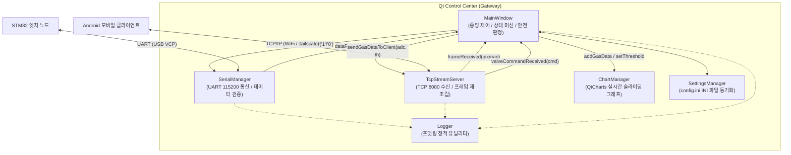
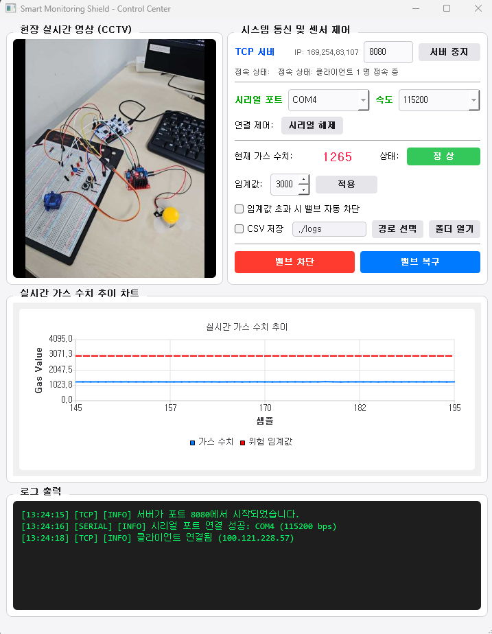
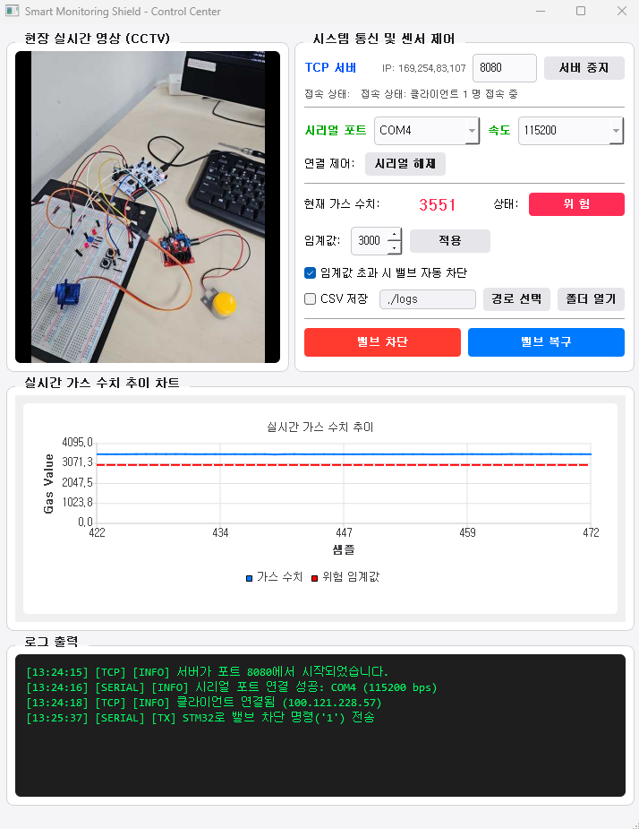
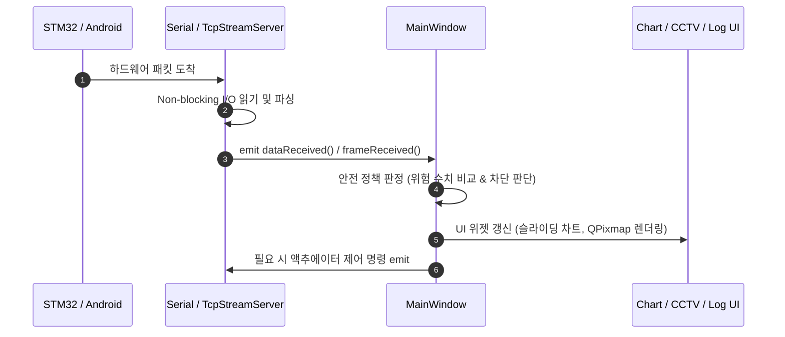

# Qt 데스크톱 관제 서버 설계서 (Qt Control Center v1.0)

본 문서는 **스마트 가스 모니터링 시스템**의 중앙 관제 허브이자 게이트웨이인 Qt 데스크톱 관제 서버(`qt-server`)의 소프트웨어 아키텍처, 시그널-슬롯 기반 비동기 이벤트 라우팅, 모듈별 상세 구현, 그리고 고반응성 UI 최적화 기법을 정의합니다.

---

## 📋 목차

1. 관제 서버 아키텍처 및 모듈 구성
2. 시그널-슬롯 기반 비동기 이벤트 라우팅
3. 시리얼 통신 및 데이터 검증 (SerialManager)
4. 고성능 TCP 스트림 서버 및 프레이밍 (TcpStreamServer)
5. 실시간 시계열 차트 렌더링 (ChartManager)
6. CSV 데이터 영속화 및 설정 관리 (SettingsManager)
7. 고반응성 UI 최적화 기법 (Event Filter & Signal Blocker)

---

## 1. 관제 서버 아키텍처 및 모듈 구성

Qt 관제 서버는 C++17 및 Qt Widgets를 기반으로 구축되었으며, **`MainWindow`를 중앙 중계 허브로 두고 통신, 시각화, 설정, 영속화 책임을 전담 객체로 분리한 모듈식 아키텍처**를 가집니다.



### 1.1 모듈별 책임 및 역할

| 모듈 클래스 | 주 책임 (Responsibilities) | 핵심 사용 기술 |
| :--- | :--- | :--- |
| **`MainWindow`** | • 전체 UI 제어 및 상태 배지 갱신<br>• 가스 수치 위험 판정 및 단일 트리거 자동 차단<br>• CSV 로깅 트리거 및 설정 로드/저장 | Qt Widgets, QFileDialog, QDesktopServices |
| **`SerialManager`** | • COM 포트 연결/해제 및 포트 목록 스캔<br>• 라인 단위(`\n`) ASCII 파싱 및 12비트 유효성 검증<br>• 액추에이터 제어 바이트(`'1'`, `'0'`) 전송 | `QSerialPort`, `QSerialPortInfo` |
| **`TcpStreamServer`** | • 다중/단일 TCP 클라이언트 세션 관리<br>• 4바이트 길이 헤더 기반 JPEG 비디오 재조립<br>• 제어 명령 파싱 및 가스 텔레메트리 브로드캐스트 | `QTcpServer`, `QTcpSocket`, `QDataStream` |
| **`ChartManager`** | • 최근 50개 샘플 슬라이딩 윈도우 렌더링<br>• 동적 위험 임계값 기준선(빨간 점선) 실시간 갱신 | `QtCharts`, `QLineSeries`, `QValueAxis` |
| **`SettingsManager`** | • 시스템 설정(`config.ini`) 로드 및 디스크 동기화<br>• 비정상 수치 방어 및 기본값 보정 | `QSettings`, C++11 위임 생성자 |
| **`Logger`** | • `[시각][카테고리][레벨] 메시지` 표준 포맷 생성 | Static Utility Class, `QDateTime` |

### 1.2 관제 대시보드 UI 및 상태 전이 화면

<div align="center">
  <table style="width: 100%; border: none;">
    <tr>
      <td align="center" width="50%">
        <br>
        <b>🟢 정상 운용 상태 (가스: 1265, 상태 배지: 정상)</b>
      </td>
      <td align="center" width="50%">
        <br>
        <b>🔴 위험 감지 및 자동 차단 (가스: 3551, 상태 배지: 위험)</b>
      </td>
    </tr>
  </table>
  <p><b>[그림] 가스 농도에 따른 관제 대시보드 UI 상태 전이 (실시간 영상, 슬라이딩 차트, 통신 로그 동기화)</b></p>
</div>

---

## 2. 시그널-슬롯 기반 비동기 이벤트 라우팅

UI 메인 스레드의 블로킹을 방지하기 위해 모든 I/O 작업(시리얼 수신, 네트워크 소켓 수신)은 Qt 이벤트 루프와 **시그널-슬롯(Signals & Slots)** 메커니즘으로 비동기 바인딩됩니다.



---

## 3. 시리얼 통신 및 데이터 검증 (SerialManager)

STM32로부터 매 200ms마다 수신되는 센서 텔레메트리 데이터를 수신하고 개행 문자(`\n`) 단위로 파싱합니다.

### 3.1 라인 버퍼링 및 데이터 검증 로직

```cpp
void SerialManager::onReadyRead()
{
    while (m_serialPort->canReadLine()) {
        QByteArray lineBytes = m_serialPort->readLine();
        QString line = QString::fromUtf8(lineBytes).trimmed();

        if (line.isEmpty())
            continue;

        emit rawLineReceived(line);

        bool isNumber = false;
        int adcVal = line.toInt(&isNumber);

        // 12비트 SAR ADC 유효 범위 (0 ~ 4095) 검증
        if (isNumber && adcVal >= 0 && adcVal <= 4095) {
            emit dataReceived(adcVal);
        }
    }
}
```

* **글리치 필터링**: 통신 라인 노이즈로 인해 비숫자 문자나 범위를 벗어난 음수/4096 이상의 쓰레기 데이터가 유입될 경우 자동으로 폐기하여 시스템 오작동을 방지합니다.

---

## 4. 고성능 TCP 스트림 서버 및 프레이밍 (TcpStreamServer)

스마트폰에서 전송되는 고화질 영상 프레임과 제어 명령을 단일 포트(8080)에서 수신합니다.

### 4.1 패킷 디멀티플렉싱 및 길이 헤더 재조립

TCP의 스트림 특성상 패킷 단편화(Fragmentation)가 발생할 수 있으므로, 내부 버퍼(`m_buffer`)를 유지하며 프레임 경계를 완벽히 복원합니다.

```cpp
void TcpStreamServer::onReadyRead()
{
    QTcpSocket* socket = qobject_cast<QTcpSocket*>(sender());
    if (!socket || socket != m_clientSocket)
        return;

    m_buffer.append(socket->readAll());

    while (!m_buffer.isEmpty()) {
        if (m_imageSize == 0) {
            // 1. 텍스트 제어 명령 분기 ('1' 차단 / '0' 복구)
            if (static_cast<unsigned char>(m_buffer[0]) != 0x00) {
                int newlineIdx = m_buffer.indexOf('\n');
                if (newlineIdx != -1) {
                    QByteArray lineBytes = m_buffer.left(newlineIdx).trimmed();
                    m_buffer.remove(0, newlineIdx + 1);

                    QString cmd = QString::fromUtf8(lineBytes);
                    if (cmd == "1" || cmd == "0") {
                        emit valveCommandReceived(cmd.at(0).toLatin1());
                    }
                } else if (m_buffer.size() == 1 && (m_buffer[0] == '1' || m_buffer[0] == '0')) {
                    char cmdChar = m_buffer[0];
                    m_buffer.remove(0, 1);
                    emit valveCommandReceived(cmdChar);
                } else {
                    break;
                }
                continue;
            }

            // 2. 비디오 프레임 4바이트 Big-Endian 길이 헤더 파싱
            if (m_buffer.size() < static_cast<int>(sizeof(qint32)))
                break;

            QDataStream stream(m_buffer.left(sizeof(qint32)));
            stream.setByteOrder(QDataStream::BigEndian);
            stream >> m_imageSize;
            m_buffer.remove(0, sizeof(qint32));

            // 비정상 패킷 방어 (0 이하 또는 10MB 초과)
            if (m_imageSize <= 0 || m_imageSize > 10 * 1024 * 1024) {
                emit logMessage(Logger::format(LogCategory::TCP, LogLevel::Warn,
                    QString("비정상 패킷 감지 (%1 Bytes). 버퍼를 초기화합니다.").arg(m_imageSize)));
                m_buffer.clear();
                m_imageSize = 0;
                return;
            }
        }

        // 3. JPEG 이미지 페이로드 수신 대기 및 디코딩
        if (m_buffer.size() < m_imageSize)
            break;

        QByteArray jpegData = m_buffer.left(m_imageSize);
        m_buffer.remove(0, m_imageSize);

        QPixmap pixmap;
        if (pixmap.loadFromData(jpegData, "JPEG")) {
            emit frameReceived(pixmap);
        }

        m_imageSize = 0;
    }
}
```

---

## 5. 실시간 시계열 차트 렌더링 (ChartManager)

가스 계측 데이터를 실시간으로 시각화하기 위해 최근 50개의 데이터만 화면에 유지하는 **슬라이딩 윈도우(Sliding Window)** 기법을 적용합니다.

```cpp
void ChartManager::addGasData(int value)
{
    m_gasSeries->append(m_dataIndex, value);

    // 최근 50개 포인트 유지 및 X축 동적 스크롤
    if (m_dataIndex > m_maxDataPoints) {
        m_gasSeries->remove(0);
        m_axisX->setRange(m_dataIndex - m_maxDataPoints, m_dataIndex);
    } else {
        m_axisX->setRange(0, m_maxDataPoints);
    }

    m_dataIndex++;
    updateThresholdLine(); // 임계값 기준선 양 끝점 동기화
}
```

* **QPainter::Antialiasing 적용**: 차트 곡선 계단 현상을 제거하여 관제 시인성을 향상시킵니다.
* **임계값 기준선 동기화**: X축이 우측으로 슬라이딩할 때 임계값 빨간 점선(`m_thresholdSeries`)의 시작/끝 좌표를 X축 최소/최대값과 일치시켜 기준선이 끊김 없이 표시됩니다.

---

## 6. CSV 데이터 영속화 및 설정 관리 (SettingsManager)

### 6.1 CSV 일별 자동 회전 로깅

수신된 계측값은 관제자가 설정한 경로에 날짜별 파일(`gas_log_YYYY-MM-DD.csv`)로 저장됩니다.

```cpp
void MainWindow::logGasDataToCsv(int adcValue, int threshold, bool isDanger)
{
    if (ui->chkEnableLogging && !ui->chkEnableLogging->isChecked())
        return;

    QDir dir(m_saveDirPath);
    if (!dir.exists()) dir.mkpath(".");

    QString dateStr = QDate::currentDate().toString("yyyy-MM-dd");
    QString filePath = QString("%1/gas_log_%2.csv").arg(m_saveDirPath, dateStr);

    QFile file(filePath);
    bool isNewFile = !file.exists();

    if (file.open(QIODevice::WriteOnly | QIODevice::Append | QIODevice::Text)) {
        QTextStream out(&file);
        if (isNewFile) {
            out << "Timestamp,ADC_Value,Threshold,Status\n";
        }
        QString timestamp = QDateTime::currentDateTime().toString("yyyy-MM-dd HH:mm:ss");
        QString status = isDanger ? "DANGER" : "NORMAL";
        out << timestamp << "," << adcValue << "," << threshold << "," << status << "\n";
        file.close();
    }
}
```

---

### 6.2 INI 파일 기반 설정 관리

프로그램 종료 시 UI 컨트롤 상태를 `config.ini`에 저장하고, 실행 시 복원합니다.

```ini
[Safety]
gas_threshold=3000
auto_close_enabled=true

[Serial]
port_name=COM4
baud_rate=115200

[Network]
tcp_port=8080

[Logging]
csv_save_enabled=true
csv_log_path=./logs
```

---

## 7. 고반응성 UI 최적화 기법 (Event Filter & Signal Blocker)

### 7.1 시리얼 포트 동적 스캔 및 QSignalBlocker 최적화

사용자가 장치를 연결하기 위해 포트 콤보박스를 클릭할 때 실시간으로 사용 가능한 COM 포트를 재스캔합니다.

```cpp
bool MainWindow::eventFilter(QObject* watched, QEvent* event)
{
    // 콤보박스 클릭 시 미연결 상태일 때만 포트 목록을 동적으로 재스캔
    if (watched == ui->cbPortList && event->type() == QEvent::MouseButtonPress) {
        if (m_serialManager && !m_serialManager->isConnected()) {
            updatePortList();
        }
    }
    return QMainWindow::eventFilter(watched, event);
}

void MainWindow::updatePortList()
{
    if (!ui->cbPortList || !m_serialManager) return;

    // UI 갱신 중 불필요한 currentIndexChanged 연쇄 시그널 억제
    const QSignalBlocker blocker(ui->cbPortList);

    const QString currentText = ui->cbPortList->currentText();
    ui->cbPortList->clear();

    QStringList ports = m_serialManager->availablePorts();
    if (ports.isEmpty()) {
        for (int i = 1; i <= 10; ++i) ports.append(QString("COM%1").arg(i));
    }
    ui->cbPortList->addItems(ports);

    int idx = ui->cbPortList->findText(currentText);
    if (idx != -1) ui->cbPortList->setCurrentIndex(idx);
}
```

* **시그널 폭풍 억제**: `clear()` 및 `addItems()` 실행 중 방출되는 다수의 `currentIndexChanged` 시그널을 `QSignalBlocker`로 차단하여 설정값 오염 및 UI 깜빡임을 방지합니다.