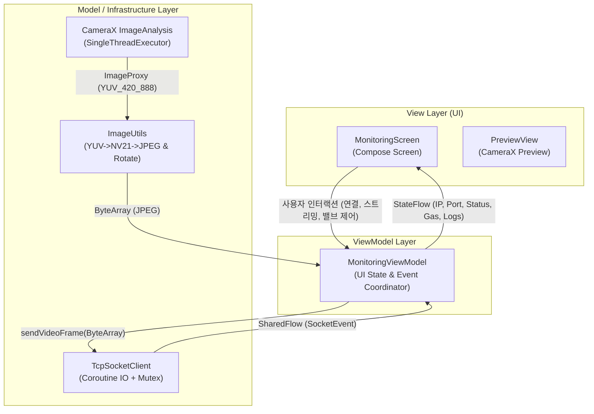
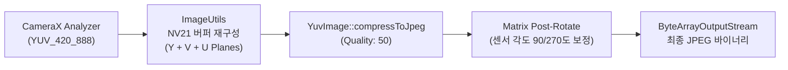
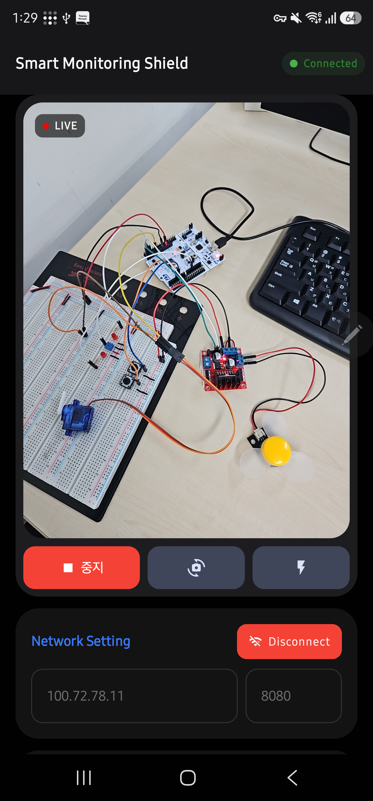
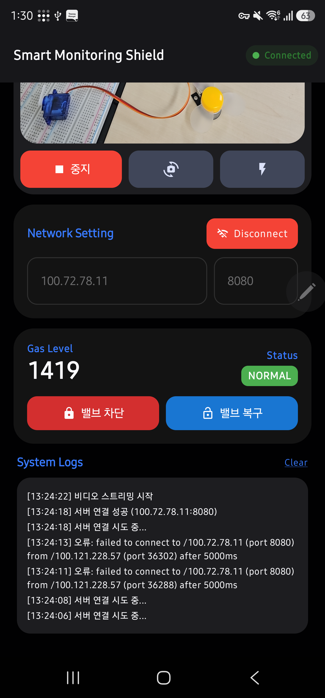

# Android 모바일 스트리밍 클라이언트 설계서 (Android Streaming Client v1.0)

본 문서는 **스마트 가스 모니터링 시스템**의 모바일 영상 및 원격 제어 클라이언트인 Android 애플리케이션(`android/`)의 소프트웨어 아키텍처, CameraX 이미지 처리 파이프라인, 코루틴 기반 비동기 네트워크 엔진, 그리고 Jetpack Compose UI 반응형 상태 관리 구조를 정의합니다.

---

## 📋 목차

1. 모바일 클라이언트 아키텍처 (MVVM + Jetpack Compose)
2. CameraX 영상 취득 및 압축 파이프라인 (ImageUtils)
3. 코루틴 기반 비동기 소켓 엔진 (TcpSocketClient)
4. 반응형 상태 관리 및 텔레메트리 바인딩 (MonitoringViewModel)
5. Jetpack Compose 모듈식 UI 설계 (MonitoringScreen)
6. 실시간 스트리밍 지연(Latency) 최소화 및 자원 최적화 기법

---

## 1. 모바일 클라이언트 아키텍처 (MVVM + Jetpack Compose)

안드로이드 클라이언트는 단방향 데이터 흐름(UDF, Unidirectional Data Flow)을 따르는 **MVVM(Model-View-ViewModel)** 패턴과 선언형 UI 프레임워크인 **Jetpack Compose**를 기반으로 설계되었습니다.



### 1.1 주요 컴포넌트 및 계층별 역할

| 컴포넌트 | 계층 | 역할 및 핵심 기능 |
| :--- | :--- | :--- |
| **`MonitoringScreen`** | View | • 카메라 프리뷰(Surface), 네트워크 설정, 원격 제어, 시스템 로그 UI 렌더링<br>• Compose 라이프사이클 기반 권한 요청 및 이벤트 바인딩 |
| **`MonitoringViewModel`** | ViewModel | • `StateFlow`를 통한 UI 상태(연결 상태, 가스 수치, 스트리밍 플래그) 관리<br>• `GAS:val:th` 텔레메트리 파싱 및 소켓 송수신 조율 |
| **`TcpSocketClient`** | Model (Network) | • `Dispatchers.IO` 코루틴 기반 비동기 TCP 소켓 엔진<br>• `Mutex`를 활용한 바이너리/텍스트 송신 스레드 동기화 및 4바이트 길이 헤더 패킷화 |
| **`ImageUtils`** | Model (Utility) | • CameraX `ImageProxy` $\rightarrow$ NV21 $\rightarrow$ 회전 보정 JPEG 변환 및 압축 파이프라인 |

---

## 2. CameraX 영상 취득 및 압축 파이프라인 (ImageUtils)

실시간 무선 전송을 위해 CameraX의 프레임을 최소 지연 시간으로 압축 및 보정하는 이미지 파이프라인을 구축했습니다.



### 2.1 ImageProxy to JPEG 변환 구현 (`ImageUtils.kt`)

```kotlin
object ImageUtils {
    fun imageProxyToJpeg(imageProxy: ImageProxy, quality: Int = 50): ByteArray? {
        if (imageProxy.format != ImageFormat.YUV_420_888) return null

        val yBuffer = imageProxy.planes[0].buffer
        val uBuffer = imageProxy.planes[1].buffer
        val vBuffer = imageProxy.planes[2].buffer

        val ySize = yBuffer.remaining()
        val uSize = uBuffer.remaining()
        val vSize = vBuffer.remaining()

        // NV21 포맷 버퍼 구성 (Y + V + U)
        val nv21 = ByteArray(ySize + uSize + vSize)
        yBuffer.get(nv21, 0, ySize)
        vBuffer.get(nv21, ySize, vSize)
        uBuffer.get(nv21, ySize + vSize, uSize)

        val yuvImage = YuvImage(nv21, ImageFormat.NV21, imageProxy.width, imageProxy.height, null)
        val out = ByteArrayOutputStream()
        yuvImage.compressToJpeg(Rect(0, 0, imageProxy.width, imageProxy.height), quality, out)
        val imageBytes = out.toByteArray()

        val rotation = imageProxy.imageInfo.rotationDegrees
        if (rotation == 0) return imageBytes

        // 센서 회전 각도(90도, 270도) 보정
        val bitmap = BitmapFactory.decodeByteArray(imageBytes, 0, imageBytes.size) ?: return null
        val matrix = Matrix().apply { postRotate(rotation.toFloat()) }
        val rotatedBitmap = Bitmap.createBitmap(bitmap, 0, 0, bitmap.width, bitmap.height, matrix, true)

        val rotatedOut = ByteArrayOutputStream()
        rotatedBitmap.compress(Bitmap.CompressFormat.JPEG, quality, rotatedOut)

        bitmap.recycle()
        rotatedBitmap.recycle()

        return rotatedOut.toByteArray()
    }
}
```

* **압축 품질(Quality 50) 선정**: 화질 저하를 육안으로 체감하기 어려운 수준으로 유지하면서 프레임 크기를 수십 KB 단위로 축소하여 802.11 Wi-Fi 및 Tailscale VPN 환경에서 프레임 레이트를 극대화했습니다.
* **메모리 누수 방지**: `Bitmap.createBitmap()`으로 생성된 중간 비트맵 객체를 즉시 `recycle()`하여 안드로이드 가비지 컬렉터(GC) 압박을 제거했습니다.

---

## 3. 코루틴 기반 비동기 소켓 엔진 (TcpSocketClient)

`TcpSocketClient`는 UI 메인 스레드를 차단하지 않고 I/O 전용 코루틴(`Dispatchers.IO`) 풀에서 동작합니다.

### 3.1 4바이트 Big-Endian 길이 헤더 패킷화 (`sendRaw`)

```kotlin
class TcpSocketClient(private val scope: CoroutineScope) {
    private var outputStream: OutputStream? = null
    private val sendMutex = Mutex() // 송신 스레드 안전성 보장 락

    fun sendRaw(data: ByteArray) {
        scope.launch(Dispatchers.IO) {
            sendMutex.withLock {
                try {
                    outputStream?.let { os ->
                        val size = data.size
                        // 4바이트 Big-Endian 페이로드 길이 헤더 생성
                        os.write(
                            byteArrayOf(
                                (size ushr 24).toByte(),
                                (size ushr 16).toByte(),
                                (size ushr 8).toByte(),
                                size.toByte()
                            )
                        )
                        os.write(data)
                        os.flush()
                    }
                } catch (_: Exception) {
                    // 고빈도 스트리밍 패킷 에러는 채널 혼잡 방지를 위해 무시
                }
            }
        }
    }

    fun sendText(text: String) {
        scope.launch(Dispatchers.IO) {
            sendMutex.withLock {
                try {
                    writer?.println(text) // '1\n' 또는 '0\n'
                } catch (e: Exception) {
                    _events.emit(SocketEvent.Error("명령 전송 실패: ${e.message}"))
                }
            }
        }
    }
}
```

* **스레드 안전성(`Mutex`)**: 카메라 프레임 분석 스레드와 사용자의 밸브 제어 클릭 이벤트가 동시에 소켓 출력 스트림에 접근하더라도 패킷이 깨지지 않도록 `Mutex.withLock` 동기화를 적용했습니다.

---

## 4. 반응형 상태 관리 및 텔레메트리 바인딩 (MonitoringViewModel)

### 4.1 UI 상태 구조 및 초기값

* **기본 접속 IP**: `100.72.78.11` (Tailscale VPN 사설망 IP 지원)
* **기본 포트**: `8080`
* **기본 임계값**: `3000`

```kotlin
class MonitoringViewModel : ViewModel() {
    private val _ip = MutableStateFlow("100.72.78.11")
    val ip = _ip.asStateFlow()

    private val _isConnected = MutableStateFlow(false)
    val isConnected = _isConnected.asStateFlow()

    private val _isStreaming = MutableStateFlow(false)
    val isStreaming = _isStreaming.asStateFlow()

    private val _gasValue = MutableStateFlow(0)
    val gasValue = _gasValue.asStateFlow()

    private val _threshold = MutableStateFlow(3000)
    val threshold = _threshold.asStateFlow()

    private val _logs = MutableStateFlow<List<String>>(emptyList())
    val logs = _logs.asStateFlow()
    
    // ...
}
```

### 4.2 실시간 가스 텔레메트리 파싱

Qt 관제 서버에서 매 200ms마다 브로드캐스트하는 `GAS:<val>:<throll>` 메시지를 파싱하여 UI 상태로 바인딩합니다.

```kotlin
private fun observeSocketEvents() {
    viewModelScope.launch {
        socketClient.events.collect { event ->
            when (event) {
                is SocketEvent.Connected -> {
                    _isConnected.value = true
                    addLog("서버 연결 성공 (${event.ip}:${event.port})")
                }
                is SocketEvent.Disconnected -> {
                    _isConnected.value = false
                    _isStreaming.value = false
                    addLog(event.message ?: "서버 연결 해제됨")
                }
                is SocketEvent.MessageReceived -> {
                    val text = event.text.trim()
                    if (text.startsWith("GAS:")) {
                        val parts = text.split(":")
                        if (parts.size >= 3) {
                            _gasValue.value = parts[1].toIntOrNull() ?: _gasValue.value
                            _threshold.value = parts[2].toIntOrNull() ?: _threshold.value
                        }
                    } else {
                        addLog("수신: $text")
                    }
                }
                is SocketEvent.Error -> addLog("오류: ${event.message}")
            }
        }
    }
}
```

---

## 5. Jetpack Compose 모듈식 UI 설계 (MonitoringScreen)

화면은 유지보수성과 재사용성을 위해 4개의 독립 섹션 컴포저블로 모듈화되었습니다.

```text
+-------------------------------------------------------------+
| TopAppBar: Smart Monitoring Shield        [ Connected 배지 ] |
+-------------------------------------------------------------+
|                                                             |
| [ CameraSection ]                                           |
| +---------------------------------------------------------+ |
| | PreviewView (3:4 비율 전/후면 카메라 프리뷰)  [ LIVE 배지 ] | |
| +---------------------------------------------------------+ |
| [ 전송/중지 버튼 ]     [ 카메라 전환 버튼 ]    [ 플래시 토글 ]|
|                                                             |
| [ ConnectionSection ]                                       |
| Server IP: [ 100.72.78.11 ]   Port: [ 8080 ]  [ Disconnect ]|
|                                                             |
| [ GasControlSection ]                                       |
| Gas Level: 1270                Status: [ NORMAL / DANGER ]  |
| [ 밸브 차단 ('1') ]             [ 밸브 복구 ('0') ]           |
|                                                             |
| [ LogSection ]                                              |
| +---------------------------------------------------------+ |
| | [12:30:15] 서버 연결 성공 (100.72.78.11:8080)            | |
| | [12:30:16] 비디오 스트리밍 시작                            | |
| +---------------------------------------------------------+ |
+-------------------------------------------------------------+
```

<div align="center">
  <table style="width: 100%; border: none;">
    <tr>
      <td align="center" width="50%">
        <br>
        <b>📹 [상단부] CameraX 영상 송출 및 Tailscale VPN 연결</b>
      </td>
      <td align="center" width="50%">
        <br>
        <b>🎛️ [하단부] 실시간 가스 텔레메트리, 원격 밸브 제어 및 로그</b>
      </td>
    </tr>
  </table>
  <p><b>[그림] Jetpack Compose 기반 Android 단일 화면 UI 분할 구성</b></p>
</div>

1. **`CameraSection`**: CameraX `PreviewView`를 `AndroidView`로 래핑하여 3:4 화면 비율 유지 및 LIVE 상태 칩 표시.
2. **`ConnectionSection`**: 서버 IP/Port 입력 및 단일 토글 연결 버튼.
3. **`GasControlSection`**: 실시간 가스 농도 수치 및 DANGER/NORMAL 동적 색상 배지, 원격 밸브 차단/복구 제어 버튼.
4. **`LogSection`**: `logs.asReversed()` 기반 최근 100개 슬라이딩 이벤트 로그 출력 창.

---

## 6. 실시간 스트리밍 지연(Latency) 최소화 및 자원 최적화 기법

### 6.1 최신 프레임 킵 전략 (`STRATEGY_KEEP_ONLY_LATEST`)

무선 네트워크 지연(Jitter) 발생 시 큐에 쌓인 이전 프레임을 전송하느라 영상 지연이 누적되는 현상을 방지하기 위해 CameraX 배압 전략(Backpressure Strategy)을 적용했습니다.

```kotlin
val imageAnalysis = ImageAnalysis.Builder()
    .setResolutionSelector(resolutionSelector)
    .setBackpressureStrategy(ImageAnalysis.STRATEGY_KEEP_ONLY_LATEST)
    .build()
```

* **동작 방식**: 이미지 분석기가 이전 프레임을 처리 중일 때 들어오는 새로운 프레임은 버퍼에 쌓지 않고 즉시 드롭하여, 항상 **최신 시점의 프레임만 네트워크로 송출**합니다.

### 6.2 전용 단일 스레드 풀 격리

카메라 프레임 인코딩 작업이 UI 렌더링 스레드에 간섭하지 않도록 전용 `SingleThreadExecutor`를 할당하고 컴포저블 라이프사이클 종료(`onDispose`) 시 안전하게 해제합니다.

```kotlin
val cameraExecutor = remember { Executors.newSingleThreadExecutor() }
DisposableEffect(Unit) {
    onDispose {
        cameraExecutor.shutdown() // 컴포저블 파괴 시 스레드 풀 안전 종료
    }
}
```