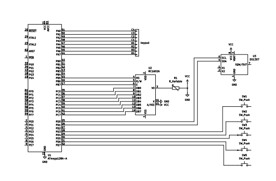
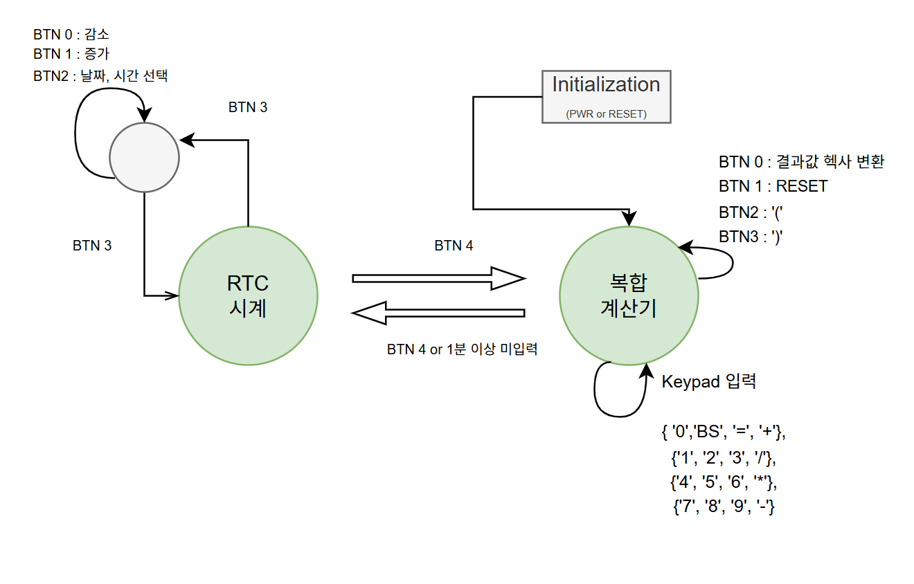

# LCD_CAL_RTC — LCD 계산기 & RTC 시계

ATmega128A 기반 계산기. 

LCD1602(4bit 모드)에 사칙연산 결과를 표시하고, 버튼으로 DS1307 RTC 시계 화면과 전환

---

## 📹 동작 영상


---

## 🔧 기술 스택

| 분류 | 내용 |
|------|------|
| MCU | ATmega128A |
| 언어 | C (AVR-GCC) |
| IDE | Atmel Studio 7 |
| 통신 | UART0 (PC 디버깅), I2C(TWI) — DS1307 |
| RTC | DS1307 (I2C, SDA/SCL 2선) |
| 표시 | LCD1602 (4bit 모드, 2행×16열) |
| 입력 | 4×4 키패드, 스위치 × 5 (BUTTON0~4) |

---
### 회로도



---

## 📐 하드웨어 핀맵

### LCD1602 (4bit 모드)
```
PB5 → RS
PB6 → R/W
PB7 → E
PC4~PC7 → DB4~DB7 (상위 니블만 사용)
VO → 가변저항 (VCC-GND 전압분배로 명암 조절)
LED+/LED- → 백라이트 전원
```

### DS1307 (I2C)
```
PD0 → SCL
PD1 → SDA
(하드웨어 TWI 모듈 사용, 100kHz)
```

### 4×4 키패드
```
PORTA → row(입력) / col(출력)

키 배열
0  ⌫  =  +
1  2  3  /
4  5  6  *
7  8  9  -
```

### 스위치 (PORTD, pull-down 기준 active-high)
```
PD3 → BUTTON0 : 결과 HEX ↔ DEC 토글
PD4 → BUTTON1 : reset (C와 동일)
PD5 → BUTTON2 : '('
PD6 → BUTTON3 : ')'
PD7 → BUTTON4 : CAL MODE ↔ CLOCK MODE 전환
```

---

## 🗂️ 파일 구조

```
LCD_CAL_RTC/
├── main.c        — 메인 루프, 모드 전환, 초기화
├── lcd.c/h        — LCD1602 4bit 드라이버
├── cal.c/h        — 계산기 로직 (중위표기법 계산, 괄호검사, 에러처리)
├── keypad.c/h     — 4×4 키패드 스캔
├── button.c/h     — 스위치 입력 처리 (디바운싱)
├── queue.c/h       — 원형 큐 (인터럽트-메인루프 분리)
├── i2c.c/h        — I2C(TWI) 하드웨어 통신 드라이버
├── ds1307.c/h     — DS1307 RTC 레지스터 read/write
└── uart0.c/h      — PC 디버깅용 UART (printf 리다이렉트)
```

---

## 모드 전환 FSM

```
전원 ON
   │
   ▼
CAL MODE ◄──────── BUTTON4 ────────► CLOCK MODE
(키패드 계산)                         (DS1307 시간/날짜 표시, 1초마다 갱신)
```

### 계산기 내부 FSM (cal_input)



```
            숫자 / 연산자 / ⌫
                 ┌────┐
                 ▼    │
  ┌──────────► INPUT ─┘
  │                │
  │            '=' 입력
  │                │
  │        ┌───────┴───────┐
  │     괄호 실패        괄호 통과 → 계산
  │        │                  │
  │        ▼            ┌─────┴─────┐
  │     ERROR         정상        0으로 나눔
  │   (PAREN ERR /       │              │
  │    ERR 표시)         ▼              ▼
  │        │         RESULT ◄───────────┘
  │  아무 키              │
  └────────┴──────새 입력─┘
                          │
                     'H' (HEX/DEC 토글, 자기 루프)

'C' 입력 시 어느 상태에서든 즉시 INPUT(초기화)으로 이동
```

---

## 💡 주요 코드

### 1. LCD 4bit 초기화 — 니블 1회 전송이 필요한 예외 구간

데이터시트 초기화 시퀀스 중, "8bit → 4bit 인터페이스 전환" 단계는 LCD가 아직 8bit 모드로 남아있는 상태라 일반적인 "니블 2번 분할 전송" 규칙이 적용되지 않음. 
이 구간만 `PORT_DATA`에 직접 값을 싣고 `lcd_pulse_enable()`을 1번만 호출

```c
PORT_DATA = 0x30;
lcd_pulse_enable();
_delay_ms(5);

PORT_DATA = 0x30;
lcd_pulse_enable();
_delay_us(100);

PORT_DATA = 0x30;
lcd_pulse_enable();
_delay_us(100);

PORT_DATA = COMMAND_SET_INTERFACE_4BIT;  // 0x20, 니블 1회
lcd_pulse_enable();
_delay_us(100);

lcd_write_command(COMMAND_4_BIT_MODE);   // 이제부터 니블 2회 분할 전송 가능
```

### 2. 원형 큐 — 인터럽트(생산자) / 메인루프(소비자) 분리

```c
int queue_full(void)  { return (rear+1) % QUEUE_MAX == front; }
int queue_empty(void) { return rear == front; }

// ISR: 키패드 감지 → 큐에 적재만
ISR(TIMER0_OVF_vect)
{
    if (keydata = keypad_scan())
        insert_queue(keydata);
}

// 메인 루프: 큐에서 꺼내서 실제 계산 처리
if (!queue_empty()) {
    uint8_t key = read_queue();
    cal_input(&cal, key);
}
```

### 3. 우선순위 기반 두 스택 계산 (중위 표기법)

```c
static uint8_t precedence(char op)
{
    if (op == '+' || op == '-') return 1;
    if (op == '*' || op == '/') return 2;
    return 0;
}

// 연산자를 만나면, 스택 위 연산자 우선순위가 같거나 높으면 먼저 계산
while (op_top >= 0 && op_stack[op_top] != '(' &&
       precedence(op_stack[op_top]) >= precedence(expr[i]))
{
    int32_t b = num_stack[num_top--];
    int32_t a = num_stack[num_top--];
    char op   = op_stack[op_top--];
    num_stack[++num_top] = apply_op(a, b, op);
}
op_stack[++op_top] = expr[i];
```

> 예) `2*3+4` → `*`(우선순위2) 를 먼저 계산(2×3=6) 후 `+` 를 push → 올바른 결과 `10`

### 4. 괄호 짝 검사 — depth 카운터

```c
static uint8_t check_parens(char *expr)
{
    int8_t depth = 0;
    for (int8_t i = 0; expr[i] != '\0'; i++)
    {
        if (expr[i] == '(') depth++;
        else if (expr[i] == ')') {
            depth--;
            if (depth < 0) return 0;   // '(' 없이 ')' 부터 나옴
        }
    }
    return (depth == 0);   // 0이 아니면 괄호 누락
}
```

### 5. I2C(TWI) 기반 DS1307 시간 읽기

```c
uint8_t read_ds1307(uint8_t addr, uint8_t* rx_buff)
{
    i2c_start();
    i2c_slave_addr_send((DS1307_ADDR << 1) | 0);   // SLAVE_ADDR + W
    i2c_data_write(addr);                          // 읽을 레지스터 지정

    i2c_start();                                    // Repeated START
    i2c_slave_addr_send((DS1307_ADDR << 1) | 1);    // SLAVE_ADDR + R

    *rx_buff = bcd2dec(i2c_data_read_nacksend());    // BCD → DEC 변환 후 저장
    i2c_stop();
}
```

---

## 📚 알아야 할 개념

### Busy Flag (BF)
- LCD 상태 레지스터의 DB7 비트. 명령 처리 중이면 1, 처리 끝나면 0
- BF를 폴링하면 명령별 최소 시간만 기다려서 더 빠르지만, 구현이 복잡함
- 본 프로젝트는 **고정 딜레이 방식**(각 명령마다 데이터시트 최대 소요시간만큼 무조건 대기) 채택

### I2C(TWI) 프로토콜
- START → SLA+R/W → (Repeated START) → DATA → ACK/NACK → STOP 순서로 진행
- 레지스터 값은 BCD(Binary Coded Decimal)로 저장되어 있어 `dec2bcd()`/`bcd2dec()` 변환

### 원형 큐를 쓰는 이유
- 키패드 입력은 `TIMER0_OVF_vect` 인터럽트 안에서 감지됨
- 인터럽트 안에서 계산(`cal_input`)까지 직접 처리하면 다른 인터럽트 응답이 지연될 위험
- 인터럽트는 큐에 적재만, 메인 루프가 꺼내서 처리하는 생산자-소비자 구조

### 버튼 폴링
- 디바운스 로직은 **매 루프마다 지속적으로 폴링**되어야 정상 동작
- 조건문 안에 갇혀서 가끔만 호출되면 버튼 입력을 놓칠 수 있음

---

## 🗒️ 개발 메모

- LCD 데이터시트상 4bit 인터페이스 전환 단계는 니블 1회 전송이 원칙 (2회로 나눠 보내면 컨트롤러가 8bit 모드에 갇혀 화면 전체가 깨짐)
- VO(명암) 핀을 가변저항으로 VCC-GND 전압분배해서 연결해야 함 — 미연결 시 흰 화면만 표시됨
- 부저(수동, Timer3/OC3A 하드웨어 PWM)는 소리 자체는 정상 출력됐으나 구동 중 LCD 화면 이상 현상이 발생해 최종 구현에서는 제외
