# 🗂️ Embedded Systems Portfolio

## 👋 박수민

SSAFY에서 웹·AI 서비스를 개발하며 소프트웨어 역량을 쌓은 후, 현재 **AI시스템반도체SW개발자 과정**에서 임베디드 펌웨어 개발 직무를 목표로 학습하고 있습니다.

8bit AVR → ARM Cortex-M4 베어메탈 → Jetson 온디바이스 AI 프로젝트를 진행하며, 하드웨어를 레지스터 단위로 직접 제어하는 것부터 센서·모터를 상위 시스템(PC·모바일·AI)과 연결하는 것까지 **동작하는 결과물**을 만드는 데 집중하고 있습니다.

📧 jenny11994@naver.com &nbsp;·&nbsp; 🐙 [github.com/clap-min99](https://github.com/clap-min99)

> 각 프로젝트 제목을 누르면 핀맵, FSM, 주요 코드, 트러블슈팅이 정리된 상세 README로 이동합니다.

  
  
  
  
  
  
  
  
  

---

## 📁 한눈에 보기

| 플랫폼 | 프로젝트 | 한 줄 요약 | 인원 · 기간 | 핵심 기술 |
|:---:|---|---|:---:|---|
| **Jetson Orin Nano** | [BoardGuard](#-boardguard--pcb-불량-검사배출-시스템) | 컨베이어 위 PCB 양품/불량 판독 후 불량품 자동 배출 | 4인 (팀장) · 2주 | PatchCore, TensorRT, Flask, GPIO ↔ STM32 FSM |
| | [RPS_YOLO](#-rps_yolo--실시간-가위바위보-대전-게임) | 두 사람의 손을 인식해 가위바위보 승패 자동 판정 | 개인 · 1일 | YOLOv11n, TensorRT, PyCUDA Zero-Copy, OpenCV |
| **STM32F411RE** | [Smart Gas Monitoring](#-smart-gas-monitoring--가스-누출-감지원격-차단-시스템) | 가스 누출 감지 시 밸브 차단·환기·경보, Qt/Android 원격 관제 | 4인 · 5일 | Bare-metal C, ADC, PWM, UART, Qt, TCP |
| | [MotorControl](#-motorcontrol--dc-모터-방향속도-제어) | 버튼 클릭 패턴으로 모터 방향, UART로 속도 제어 | 3인 · 3일 | 레지스터 제어, TIM5 PWM, EXTI, UART |
| **ATmega128A** | [AutoCar](#-autocar--블루투스-rc카--자율주행) | 블루투스 수동 조종 + 초음파 장애물 회피 자율주행 RC카 | 개인 · 3일 | FSM, UART/BT, 초음파 ×3, PWM, FND |
| | [WasherFSM](#-washerfsm--세탁기-시뮬레이터) | 세탁·헹굼·탈수 시간을 설정해 순차 실행하는 세탁기 | 개인 · 3일 | FSM, Timer0, FND, PWM |
| | [LCD_CAL_RTC](#-lcd_cal_rtc--lcd-계산기--rtc-시계) | 키패드 사칙연산 계산기 + RTC 실시간 시계 | 개인 · 3일 | LCD1602, I2C(TWI), DS1307, 원형 큐 |

---

## 🟩 Jetson Orin Nano

### 🔍 [BoardGuard](./BoardGuard/README.md) — PCB 불량 검사·배출 시스템

> 👥 4인 팀 (**팀장 / AI 모델링 담당**) · ⏱ 2주

컨베이어 벨트 위 PCB를 카메라로 촬영해 양품/불량을 판독하고, 불량 위치·유형을 기록한 뒤 자동으로 배출합니다.

<table>
  <tr>
    <th>앞면 검사</th>
    <th>뒷면 검사</th>
  </tr>
  <tr>
    <td>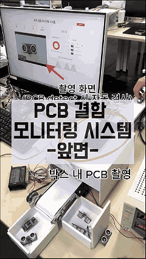</td>
    <td>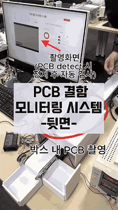</td>
  </tr>
</table>

- **비지도 이상탐지**: 정상 데이터만으로 학습하는 PatchCore로 앞/뒷면을 별도 모델·threshold로 판정
- **불량 유형 분류**: anomaly map → contour로 결함 위치를 잡고, crop 임베딩을 레퍼런스와 1-NN 매칭해 유형 추정
- **사전 판별·지연 방지**: 빈 배경 diff로 PCB 유무를 먼저 확인하고, 카메라 읽기를 별도 스레드로 분리해 최신 프레임만 사용
- **Jetson ↔ MCU 연동**: GPIO 3라인(STOP/PASS/FAIL)으로 판정 결과를 STM32 상태머신에 전달 → 스텝모터 이송 + 서보 push로 배출

`PatchCore` `TensorRT` `PyTorch` `OpenCV` `Flask` `STM32F411RE` `GPIO`

---

### ✊ [RPS_YOLO](./RPS_yolo/README.md) — 실시간 가위바위보 대전 게임

> 👤 개인 · ⏱ 1일

카메라 한 대로 두 사람의 손을 동시에 인식해 가위/바위/보를 분류하고 승패를 자동 판정합니다.

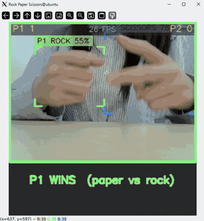

- **모델**: YOLOv11n을 커스텀 데이터셋으로 파인튜닝 (mAP50 ≈ 0.95) → ONNX → TensorRT FP16 엔진 변환 (GPU latency 약 2.1ms/frame)
- **Zero-Copy 추론**: CUDA pagelocked 메모리로 CPU-GPU 복사 없이 추론하는 범용 TensorRT 래퍼 작성
- **안정성 판정**: 최근 20프레임 중 같은 조합이 12회 이상이면 확정하는 슬라이딩 윈도우 다수결로 검출 노이즈 대응

`YOLOv11` `TensorRT` `PyCUDA` `OpenCV` `Python`

---

## 🟦 STM32F411RE (ARM Cortex-M4)

### 🛡️ [Smart Gas Monitoring](./GasMonitoring/README.md) — 가스 누출 감지·원격 차단 시스템

> 👥 4인 팀 · ⏱ 5일

밀폐 공간의 가스 누출을 실시간으로 감지하고, 위험 시 **밸브 차단 · 환기팬 구동 · 경보**를 자율/원격으로 동시에 수행하는 3계층(Edge ↔ Gateway ↔ Mobile) 안전 관제 시스템입니다.

https://github.com/user-attachments/assets/efa6ab54-6c9d-45a7-a74a-6c195651bac4

<table>
  <tr>
    <th>하드웨어 셋업</th>
    <th>Qt 관제 (정상)</th>
    <th>Qt 관제 (위험)</th>
    <th>Android 앱</th>
  </tr>
  <tr>
    <td>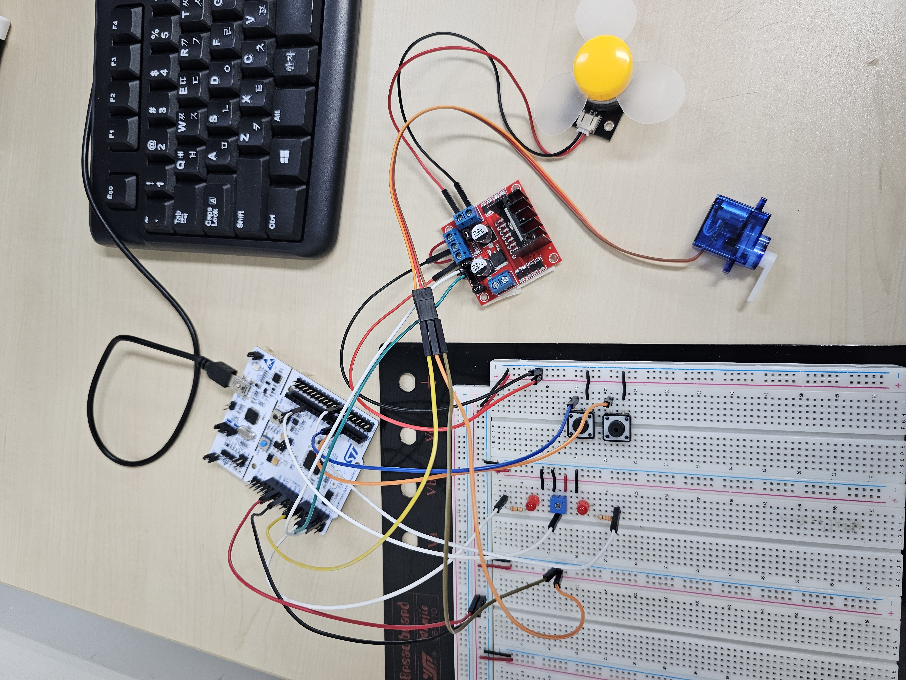</td>
    <td>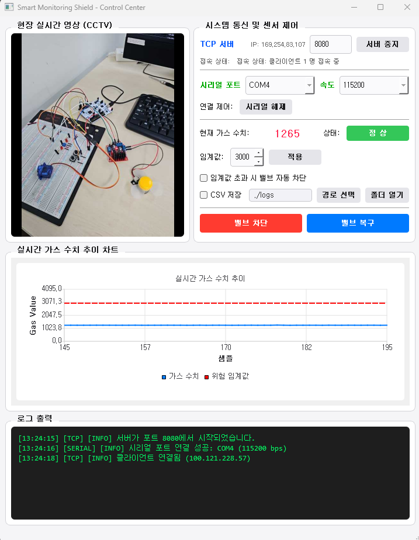</td>
    <td>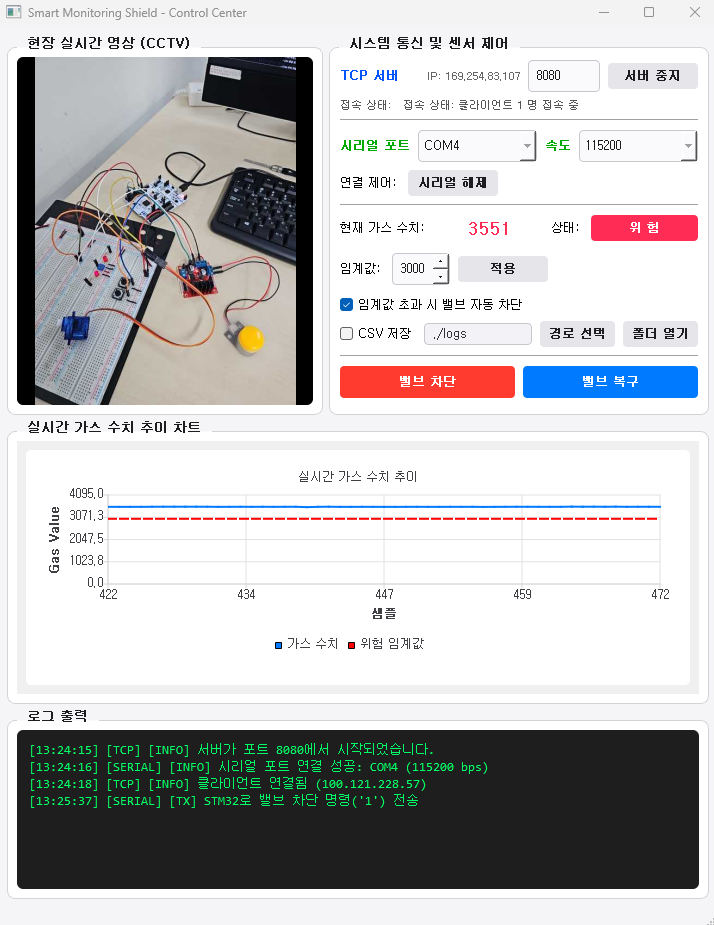</td>
    <td>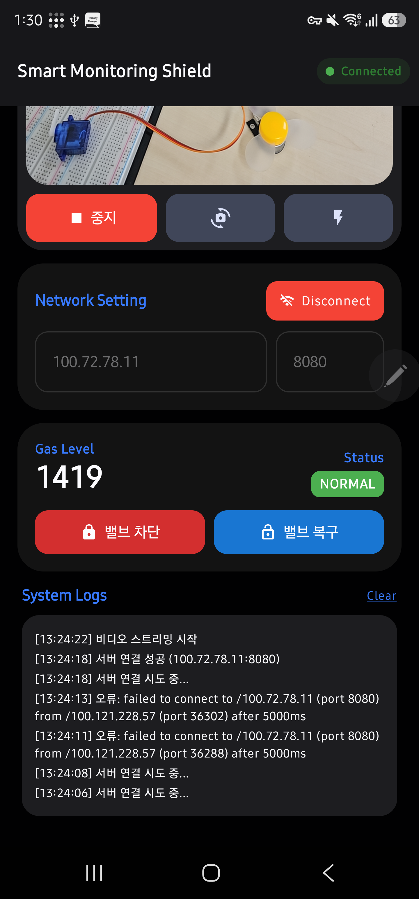</td>
  </tr>
</table>

- **Edge (STM32 베어메탈)**: HAL/RTOS 없이 레지스터 직접 제어, 96MHz PLL, 200ms 주기 ADC 가스 계측, TIM2 PWM 서보 밸브 구동
- **Gateway (Qt C++)**: UART ↔ TCP 중계, 임계값 초과 시 단일 트리거 래치로 자동 차단, 실시간 시계열 차트 + CSV 로깅
- **Mobile (Android)**: CameraX 저지연 CCTV 스트리밍, Tailscale VPN으로 외부망에서도 원격 제어

`Bare-metal C` `ADC` `PWM` `UART` `Qt 5/C++17` `TCP` `Kotlin/Compose`

---

### ⚙️ [MotorControl](./MotorControl/README.md) — DC 모터 방향·속도 제어

> 👥 3인 팀 · ⏱ 3일

버튼 클릭 패턴(단클릭/더블클릭/롱클릭)으로 DC 모터의 정회전·역회전·정지를 제어하고, UART로 받은 값에 따라 속도(기어)를 실시간 변경합니다.

- **클릭 판별**: EXTI 인터럽트로 press/release 시점을 기록하고, 시간 차로 단클릭/더블클릭/롱클릭(3초) 구분
- **PWM 속도 제어**: HAL 없이 TIM5 레지스터로 PWM 생성, 기어 1~9단 → 듀티 60~100%
- **역기전력 방지**: 방향 전환 시 500ms 정지 후 PWM 재인가

`CMSIS 레지스터` `TIM5 PWM` `EXTI` `UART` `Makefile/arm-gcc`

---

## 🟥 ATmega128A (AVR)

### 🚗 [AutoCar](./AutoCar/README.md) — 블루투스 RC카 + 자율주행

> 👤 개인 · ⏱ 3일

블루투스(UART)로 수동 조종하다가 버튼 하나로 자율주행 모드로 전환되는 RC카입니다. 초음파 센서 3개(좌/정면/우)로 장애물을 감지하고 FSM으로 회피 주행합니다.

<table>
  <tr>
    <th>주행</th>
    <th>FND — 직전 자율주행 기록</th>
  </tr>
  <tr>
    <td>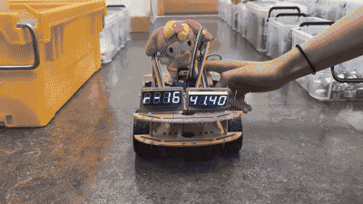</td>
    <td>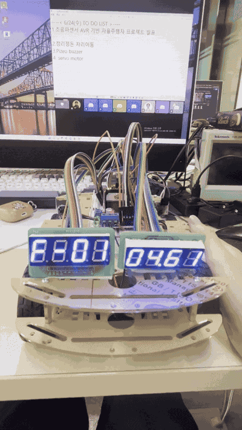</td>
  </tr>
</table>

- **초음파 측정**: HC-SR04 ×3의 Echo를 외부 인터럽트(INT4~6)로 받아 거리 계산
- **자율주행 FSM**: 좌/정면/우 거리에 따라 전진·회전·후진 판단
- **UART 수신**: 인터럽트 + 원형 큐로 수신부와 처리부 분리
- **주행 기록**: FND1에 총 주행시간, FND2에 방향별 횟수 표시

`FSM` `UART/Bluetooth` `External Interrupt` `PWM` `FND`

---

### 🧺 [WasherFSM](./WasherFSM/README.md) — 세탁기 시뮬레이터

> 👤 개인 · ⏱ 3일

버튼으로 세탁·헹굼·탈수 시간을 설정하면 순서대로 자동 실행되며, FND에 남은 시간을 표시하고 모터(팬)로 동작을 표현합니다.

- **FSM 설계**: STANDBY → 시간 설정 3단계 → 세탁 → 헹굼 → 탈수 → STANDBY, 실행 중 언제든 취소
- **Timer0 1ms 카운터**: 16MHz / 64분주, TCNT0=6 → 250 카운트 = 1ms
- **FND 멀티플렉싱**으로 남은 시간 카운트다운 표시

`FSM` `Timer0` `FND` `PWM`

---

### 🧮 [LCD_CAL_RTC](./LCD_CAL_RTC/README.md) — LCD 계산기 & RTC 시계

> 👤 개인 · ⏱ 3일

LCD1602와 4×4 키패드로 사칙연산(괄호 포함)을 처리하는 계산기이며, 버튼 하나로 DS1307 RTC와 연동된 실시간 시계 화면으로 전환됩니다.

<table>
  <tr>
    <th>계산기</th>
    <th>괄호 누락 에러</th>
    <th>시계 모드</th>
  </tr>
  <tr>
    <td></td>
    <td>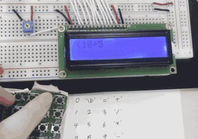</td>
    <td>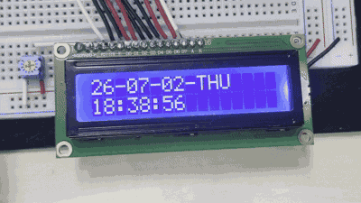</td>
  </tr>
</table>

- **LCD 4bit 드라이버**: 데이터시트 초기화 시퀀스(8bit → 4bit 전환 구간의 니블 1회 전송)까지 직접 구현
- **계산 로직**: 두 스택 기반 중위 표기법 계산, 연산자 우선순위, 괄호 짝 검사, 0으로 나누기 에러 처리
- **구조**: 키패드 ISR(생산자) ↔ 메인 루프(소비자)를 원형 큐로 분리, I2C(TWI)로 DS1307 시간 read/write

`LCD1602` `I2C(TWI)` `DS1307 RTC` `Keypad` `원형 큐`

---

## 📎 Other Projects (Web · AI 서비스)

임베디드 이전에 진행한 웹/앱 서비스 프로젝트입니다. 자세한 내용은 각 레포에 정리되어 있습니다.

| 프로젝트 | 설명 | 인원 · 기간 | 담당 | 기술 스택 |
|---|---|:---:|---|---|
| [**izi_auto**](https://github.com/clap-min99/izi_auto) | 피아노 스튜디오 네이버 예약 → 입금 확인 → 문자 발송 자동화 (실제 운영 중) | 2인 | 프론트 전반, 문자 발송 로직, 외부 API 연동, 운영 이슈 대응 | React, Django, 네이버 SENS, 팝빌 API |
| [**달디단**](https://github.com/clap-min99/daldidan) | 스마트폰 카메라로 사과 당도(Brix)를 예측하는 AI 서비스 (SSAFY) | 6인 · 6주 | 프론트, 초기 객체 인식(YOLOv8n)·당도 예측(XGBoost) 모델, UI/UX | React Native, FastAPI, YOLOv8, EfficientNet |
| [**zeepseek**](https://github.com/clap-min99/zeepseek) | 사회초년생을 위한 부동산 매물 빅데이터 기반 추천 서비스 (SSAFY) | 6인 · 7주 | 프론트, 데이터 크롤링 | React, Spring Boot, Elasticsearch |
| [**마래바**](https://github.com/clap-min99/maraeba) | 청각장애 아동을 위한 발음 교정·언어 학습 서비스 (SSAFY) | 6인 | 프론트 | React, Spring Boot, Flask, WebRTC |

---

## 🛠️ 개발 환경

| 분류 | 내용 |
|---|---|
| MCU / Board | ATmega128A, STM32F411RE (Nucleo-64), Jetson Orin Nano |
| IDE / Build | Atmel Studio 7, VSCode, Makefile + arm-none-eabi-gcc |
| 언어 | C (AVR-GCC, ARM-GCC), C++, Python, Kotlin |
| 통신 | UART, I2C(TWI), GPIO, TCP |
| AI / 추론 | YOLOv11, PatchCore, TensorRT, PyCUDA, OpenCV |
