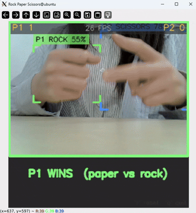

# RPS_YOLO — 실시간 가위바위보 대전 게임

카메라 한 대로 두 사람의 손을 동시에 인식해 가위/바위/보를 분류하고, 승패를 자동으로 판정하는 실시간 게임. 젯슨 오린 나노 위에서 YOLOv11n 커스텀 파인튜닝 모델을 TensorRT로 가속 추론.

---


## 동작 영상



---
## 기술 스택

| 분류 | 내용 |
|------|------|
| Board | Jetson Orin Nano |
| 모델 | YOLOv11n (Ultralytics, 커스텀 파인튜닝) |
| 학습 환경 | Google Colab (GPU 런타임) |
| 추론 가속 | TensorRT 10.x + PyCUDA (Zero-Copy 버퍼) |
| 언어 | Python |
| 비전/후처리 | OpenCV (letterbox 전처리, NMS 후처리, HUD 렌더링) |
| 데이터셋 | Roboflow Universe `rock-paper-scissors-sxsw` (v14) |
| 클래스 | `paper`, `rock`, `scissors` (3-class detection) |

---

## 파이프라인 개요

```
[카메라 320x240]
      │
      ▼
letterbox (비율유지 정사각형 320x320 패딩)
      │
      ▼
TensorRT 엔진 추론 (NCHW, FP16, Zero-Copy)
      │  출력: (1, 7, 2100)  ← (4 bbox + 3 class) x 2100 anchors
      ▼
후처리: confidence 필터 → cv2.dnn.NMSBoxes
      │
      ▼
원본 좌표계 역변환 → x좌표 기준 정렬 (좌=P1 / 우=P2)
      │
      ▼
슬라이딩 윈도우 다수결 판정 (노이즈에 강건한 안정성 판정)
      │
      ▼
승패 계산 + HUD 오버레이 표시
```

---

## 파일 구조

```
RPS_YOLO/
├── README.md
├── RPS_game_YOLO.ipynb          — 데이터 로드/학습/ONNX export (Colab)
├── trt_module.py                 — TensorRT 10.x Zero-Copy 추론 엔진 래퍼
├── RPS_game_YOLO.py               — 메인 게임 (OpenCV HUD, 상태 머신)
└── RPS_YOLO.engine                — trtexec로 변환한 TensorRT 엔진 (device-specific, 미포함)
```

---

## 핵심 구현

### 1. 데이터 & 학습

Roboflow에서 YOLOv11 포맷으로 데이터셋을 받아 Colab에서 `yolo11n.pt`를 파인튜닝 (80 epoch, imgsz=320). 최종 `mAP50 ≈ 0.95`, `mAP50-95 ≈ 0.72` 수준으로 수렴.

```python
from roboflow import Roboflow
rf = Roboflow(api_key="...")
project = rf.workspace("roboflow-58fyf").project("rock-paper-scissors-sxsw")
dataset = project.version(14).download("yolov11")

yolo = YOLO('yolo11n.pt')
yolo.train(data=f'{dataset.location}/data.yaml', epochs=80, imgsz=320)
```

학습 후 ONNX로 export하고, 젯슨 오린 나노에서 `trtexec`로 FP16 엔진 변환:

```bash
trtexec --onnx=rps_yolo11n_sxsw14.onnx --saveEngine=RPS_YOLO.engine --fp16
```

> GPU latency 실측 약 **2.1ms/frame** (trtexec 벤치마크 기준)

### 2. Zero-Copy TensorRT 추론 (`trt_module.py`)

TensorRT 10.x `execute_async_v3` API와 CUDA pagelocked 메모리를 이용해 CPU-GPU 간 명시적 복사 없이 추론하는 범용 래퍼. 입출력 텐서 개수·이름에 무관하게 동작하도록 설계해서, MobileNetV2(분류)와 YOLO(탐지) 양쪽 모델에 동일 모듈을 재사용.

```python
host_mem = cuda.pagelocked_empty(size, dtype, mem_flags=cuda.host_alloc_flags.DEVICEMAP)
device_ptr = host_mem.base.get_device_pointer()
self.context.set_tensor_address(tensor_name, int(device_ptr))
```

### 3. YOLO 출력 디코딩 + NMS

YOLOv11은 별도 objectness 없이 `(4 + num_classes, num_anchors)` 형태로 출력하므로, confidence 임계값으로 1차 필터링 후 `cv2.dnn.NMSBoxes`로 중복 박스를 제거.

```python
output = output_flat.reshape(4 + num_classes, -1).T
scores = output[:, 4:4 + num_classes]
class_ids = np.argmax(scores, axis=1)
confidences = np.max(scores, axis=1)
indices = cv2.dnn.NMSBoxes(boxes_tlwh.tolist(), confidences.tolist(), conf_thres, nms_thres)
```

### 4. 좌표계 변환 (letterbox)

카메라 해상도(320×240, 직사각형)와 모델 입력(320×320, 정사각형)이 달라서, 비율을 유지한 채 패딩을 넣어(letterbox) 정사각형으로 만들고, 추론 후 bbox를 다시 원본 프레임 좌표로 역변환.

```python
def letterbox(frame, size):
    scale = size / max(h, w)
    ...
    top, left = (size - nh) // 2, (size - nw) // 2
    canvas[top:top+nh, left:left+nw] = resized
    return canvas, scale, left, top
```

### 5. 슬라이딩 윈도우 다수결 기반 안정성 판정

"N프레임 연속 동일"하면 확정하는 방식은 검출 노이즈(bbox 흔들림, 순간 미검출) 한 번에 카운트가 전부 리셋되어 실사용에서 불안정했음. 최근 20프레임을 버퍼에 담아두고, 그중 가장 많이 나온 조합이 12회 이상이면 확정하는 다수결 방식으로 변경해 노이즈 개선.

```python
pair_buffer = deque(maxlen=STABLE_WINDOW)   # 최근 20프레임
pair_buffer.append((p1_gesture, p2_gesture))
best_pair, best_match_count = Counter(pair_buffer).most_common(1)[0]
if best_match_count >= STABLE_MATCH_COUNT:   # 12회 이상 일치 시 확정
    winner = judge(*best_pair)
```

손이 2개가 아닌 프레임이 나와도 즉시 초기화하지 않고, 일정 프레임(`MISS_RESET_LIMIT`) 이상 연속될 때만 버퍼를 리셋해 순간적인 미검출에 처리.

---

## 조작

| 키 | 동작 |
|----|------|
| `r` | P1 / P2 누적 스코어 초기화 |
| `q` | 게임 종료 |

---

## 개발 메모

- **NHWC vs NCHW 트러블슈팅**: TensorRT 엔진의 입력 shape이 `(1, 3, 320, 320)`(NCHW)인데 초기 구현은 `(1, 320, 320, 3)`(NHWC)로 입력을 넣고 있어서 추론 결과가 이상하게 나왔음 — `np.transpose(img, (2, 0, 1))`로 축 순서를 맞춰 해결
- **클래스 순서 매핑**: Roboflow `data.yaml`의 `names` 순서(`['Paper', 'Rock', 'Scissors']`)가 자체적으로 알파벳순으로 정해진 것이라, 실제 젯슨 추론 코드의 클래스 인덱스 매핑을 이 순서에 맞춰 별도로 관리해야 했음
- **손 검출 방식 단순화**: 기존 MobileNetV2 분류 방식은 `cvzone.HandDetector`로 손을 먼저 찾고 crop 후 분류하는 2단계 구조였으나, YOLO는 탐지+분류를 한 번에 수행하므로 별도 손 검출기 없이 구조를 단순화함
- **안정성 판정 튜닝**: `STABLE_WINDOW`(버퍼 크기)와 `STABLE_MATCH_COUNT`(확정 기준 횟수)는 실제 카메라 환경/FPS에 따라 감도가 달라지므로, 오검출이 잦으면 값을 낮추고 판정이 너무 성급하면 값을 올리는 방식으로 튜닝 필요